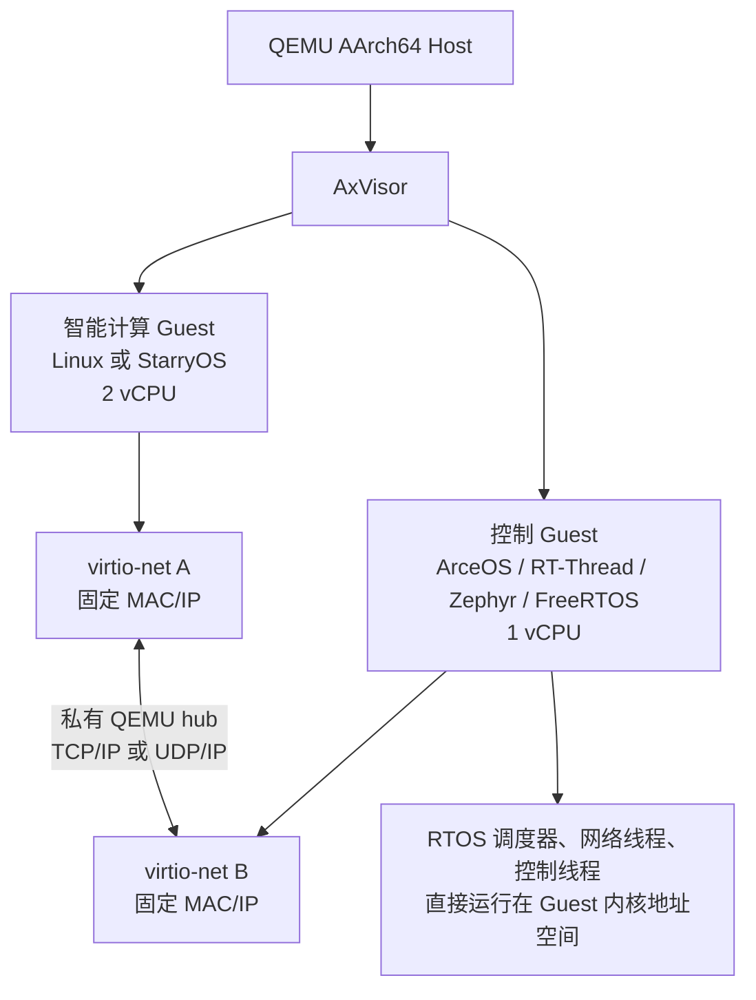
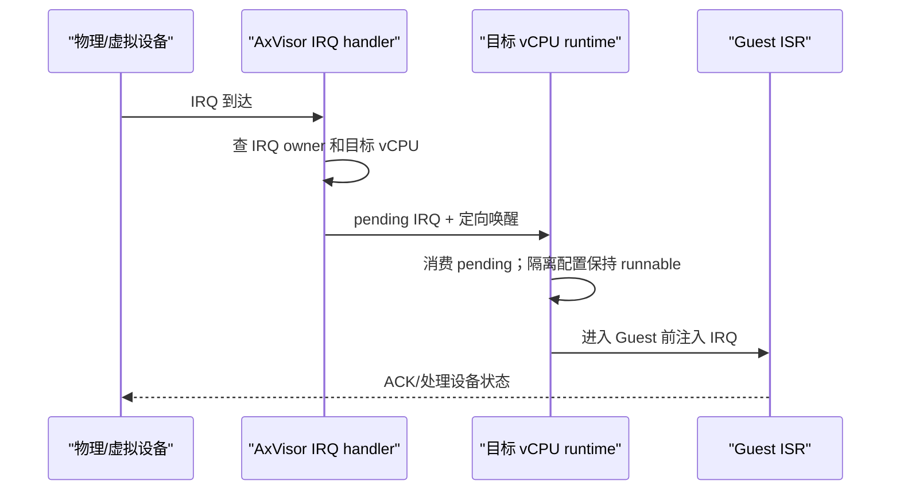
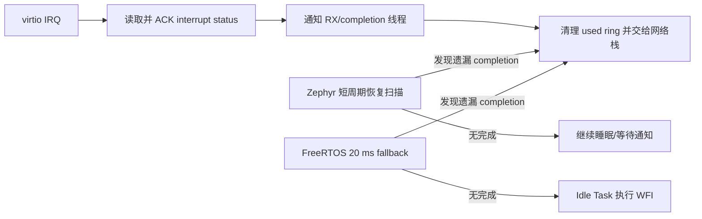

# AxVisor 智能控制平台开发记录与问题排查

这份文档用于代码维护和故障定位，记录实现过程中的代码边界、关键调用链、设计取舍和已解决问题。对外架构、测试数据、评分证据和完整复现命令见 `完整全流程实现与复现手册.md`；这里重点回答“代码具体改在哪里、为什么这样改、出现同类故障时怎样继续查”。

## 一、代码边界和目录

| 范围 | 目录或文件 | 说明 |
| --- | --- | --- |
| AxVisor 与 AxVM | `os/axvisor/`、`virtualization/axvm/` | 实时调度路径、vCPU 唤醒、IRQ 路由、VM 生命周期和配置 |
| 平台 IRQ 能力 | `platforms/ax-plat/`、`platforms/axplat-dyn/`、`platforms/somehal/`、`drivers/intc/arm-gic-driver/` | 通用 mask/unmask/enable/disable/affinity 能力，不包含 Guest 名称特判 |
| StarryOS | `os/StarryOS/`、`net/ax-net/`、`drivers/ax-driver/` | 原生 AICP 客户端、socket/ioctl、静态地址、收包唤醒和 virtio-net |
| AICP 与智能控制 | `apps/ai-rtos-demo/` | 协议、Linux 客户端、RTOS 服务端、YOLOv8、周期基线和控制算法 |
| ArceOS RTOS 扩展 | `apps/arceos/aicp-server/` | Rust AICP 服务端和 UDP/TCP 对照路径 |
| StarryOS 应用入口 | `apps/starry/aicp-control/` | StarryOS 构建、rootfs 注入和运行入口 |
| VM 与设备树配置 | `configs/ai-rtos/`、`os/axvisor/configs/` | CPU、内存、virtio、UART、GIC、IRQ 和 reserved-memory |
| 自动化 | `scripts/ai-rtos/` | 构建、启动、闭环、可靠性、实时 A/B、长稳、基线和结果提取 |

自动化脚本保留多个场景入口，但公共机制不在入口中重复实现：`lib/process.sh` 负责结束 `cargo xtask -> QEMU` 进程树，`lib/markers.sh` 负责通用 marker 等待和提前退出诊断，`lib/dtb.sh` 负责 DTS 设备裁剪、启动参数和 Linux 串口修改，`lib/run_artifacts.sh` 负责解析运行器返回的日志路径并生成统一归档。各入口只保留 Guest 镜像、地址、内存、IRQ、协议成功条件等真实差异。

第三方 RTOS 源码保持独立：

- RT-Thread 以官方 tag 为输入，脚本复制 BSP 到 `tmp/rtthread-*build` 后叠加赛事代码。
- Zephyr 使用官方源码、modules 和设备驱动，赛事应用、overlay 和必要的 legacy 适配放在 `apps/ai-rtos-demo/zephyr/`。
- FreeRTOS-Kernel 与 FreeRTOS+TCP 作为依赖，网络接口和平台适配放在 `apps/ai-rtos-demo/freertos/`。
- `scripts/ai-rtos/check_third_party_sources_clean.sh` 在构建前后检查 revision 和工作树状态。

### 1.1 代码改动索引

下表用于从功能快速定位到实际代码。后续章节继续说明关键调用链、并发边界和故障处理，不以这张表代替代码走读。

| 功能 | 主要文件 | 具体修改 | 设计原因 |
| --- | --- | --- | --- |
| AxVisor 实时配置 | `os/axvisor/configs/board/qemu-aarch64-ai-rtos.toml`、`qemu-aarch64-rt.toml` | CPU 隔离正式配置启用 `rt-poll-idle`，另保留最新 `dev` 共享阻塞等待回归基线 | 避免调度策略隐式依赖 Guest 名称 |
| vCPU 等待和唤醒 | `virtualization/axvm/src/runtime/vcpus.rs`、`runtime/mod.rs`、`vm/mod.rs` | IRQ pending 队列、目标 pCPU IPI、共享等待通知和隔离核常驻运行策略 | 避免 Guest WFI 后唯一 FIFO vCPU 任务滞留在 Host idle |
| AArch64 IRQ 注入 | `virtualization/axvm/src/arch/aarch64/gic/physical.rs`、`gic.rs`、`vgic/mod.rs` | 按 FDT 路由物理 SPI，区分 edge/level 生命周期并绑定目标 vCPU/pCPU | 正确处理透传中断与重注入 |
| 通用平台 IRQ API | `platforms/somehal/src/irq.rs`、`platforms/axplat-dyn/src/irq.rs` | 补齐 current-EL active IRQ 的硬件转发与延迟反激活 | 让 AxVM 不按 Guest 类型特判 |
| GICv3 路由修复 | `virtualization/axvm/src/boot/fdt/core/parser.rs`、`arch/aarch64/gic/physical.rs` | 解析中断描述并按真实 vCPU 亲和性选择 host CPU | 保证设备中断送到配置的 pCPU/vCPU |
| VM 构建和设备装载 | `virtualization/axvm/src/boot/fdt/core/`、`vm/mod.rs`、`os/axvisor/configs/` | 校验 CPU/内存/设备配置，按 VM 配置装载镜像、DTB 和设备 | 让 Linux 2-vCPU 与 RTOS 1-vCPU 资源分配可复现 |
| RTOS VM 配置 | `configs/ai-rtos/`、`os/axvisor/configs/vms/qemu/aarch64/`、`os/axvisor/configs/qemu/` | 增加 Linux、StarryOS、RT-Thread、Zephyr、FreeRTOS 和私有双网卡拓扑；固定 RAM、入口、MAC、IP、IRQ 和 hubport | 镜像、Stage-2、DMA 和 QEMU 设备参数必须一致 |
| AICP 协议 | `apps/ai-rtos-demo/aicp/aicp.h`、`components/aicp-protocol/src/lib.rs`、`apps/ai-rtos-demo/tests/aicp_protocol_test.c` | C 与 Rust 分别提供唯一线协议实现；定义固定头、消息类型、CRC、序号、时间戳和错误码；实现协议负向/边界测试 | 线格式和可靠性规则不能散落在不同客户端中复制 |
| AICP TCP 流与 UDP 数据报 | `apps/ai-rtos-demo/aicp/aicp_stream.h`、`aicp_datagram.h`、`aicp_posix_stream.h` | TCP 通过 read/write capability 完成字节流分帧；UDP 执行单报文精确长度、容量和 CRC 校验；POSIX 文件只连接 fd API | 两种传输共用 `aicp.h` 线格式，但不能混淆字节流和数据报边界，也不能把 RTOS socket 强制转换成 POSIX fd |
| AICP C 客户端事务 | `apps/ai-rtos-demo/aicp/aicp_client.c`、`aicp_client.h`、`tests/aicp_client_test.c` | 集中 HELLO、CONTROL_SET、STATUS/ERROR、序号校验、RTT 和事务事件回调 | Linux PID1、普通 C Client、C++ YOLOv8 和 RKNN bridge 共用同一事务语义 |
| AICP RTOS 服务状态机 | `apps/ai-rtos-demo/rtos-core/aicp_service.c`、`aicp_service.h`、`tests/aicp_service_test.c` | 集中请求解析、重复请求回放、陈旧序号拒绝、错误回复和服务统计 | RT-Thread、Zephyr、FreeRTOS 与 POSIX 参考服务端只保留系统 glue |
| 轻量神经网络与控制策略 | `apps/ai-rtos-demo/ai-model/simple_nn.c`、`control_policy.c` 及对应头文件 | 前者实现固定权重前向推理和目标轨迹，后者统一生成 fixed/ai AICP 控制参数；Linux 客户端、PID1 和模型对照程序共同链接 | 避免权重、输入生成和 PID 参数公式在三处复制后发生漂移 |
| 公共控制算法 | `apps/ai-rtos-demo/rtos-core/control_loop.c`、`.h` | 实现 fixed/ai 两种参数路径、控制状态更新和量化指标输出 | 四种控制 Guest 复用同一业务语义，便于横向比较 |
| RT-Thread Guest | `apps/ai-rtos-demo/rtthread-aicp/main.c`、`drv_virtio_aicp.c`、`rtos-core/aicp_service.c` | 接入 lwIP/SAL、virtio-net、IRQ、TCP AICP 服务端、控制动作和统计 marker | 在独立 RTOS Guest 中形成真实网络闭环 |
| Zephyr Guest | `apps/ai-rtos-demo/zephyr/src/main.c`、`virtio_mmio_legacy.c`、`axvisor-virtio.overlay` | 增加赛事应用、DTS overlay、legacy virtio 队列与有界 completion recovery | 复用 Zephyr 上游网络栈，不修改第三方源树 |
| FreeRTOS Guest | `apps/ai-rtos-demo/freertos/main.c`、`NetworkInterface.c`、`virtio_net.c`、`platform.c`、`boot.S` | 实现 FreeRTOS+TCP 网络接口、IRQ/RX task、AICP 服务、EL2 到 EL1 启动兼容和绝对 deadline timer | 同一镜像支持 AxVisor Guest 与独立 QEMU 周期基线 |
| Linux 客户端 | `apps/ai-rtos-demo/linux-client/main.c`、`linux-init/aicp_init.c`、`model-runner/` | 配置静态网络和 ARP，发送 fixed/ai 控制，采集 RTT、状态和结果 CSV | 保留轻量控制回归和模型链路对照 |
| StarryOS PID1 profile | `apps/ai-rtos-demo/linux-init/starry_profile.h` | 只覆盖 Guest 名称和日志 marker，复用与 Linux 相同的 PID1 主逻辑 | Linux 与 StarryOS 两条路径同时保留，不复制整份初始化程序 |
| Rust YOLOv8n | `apps/ai-rtos-demo/yolov8-rust-onnx/src/main.rs`、`ffi/ort_shim.c`、`yolov8-init/aicp_yolov8_init.c` | JPEG 解码、letterbox、ONNX Runtime CPU 推理、YOLOv8 后处理、NMS、控制映射和 AICP 发送 | QEMU 中运行完整通用 CPU 模型，不依赖 NPU |
| RKNN 板级路径 | `apps/starry/orangepi-5-plus-uvc-rknn/rknn-yolov8-image/cpp/aicp_bridge.*`、`aicp_main.cc`、构建脚本 | 将 RKNN 检测结果转换成相同 AICP CONTROL_SET，并保留状态回传 | 上板后只替换推理后端，不改变 RTOS 和协议 |
| StarryOS 原生客户端 | `os/StarryOS/starryos/src/native_aicp.rs`、`main.rs`、`apps/starry/aicp-control/` | 实现原生 TCP/UDP AICP 客户端、网络参数、重试、日志 marker 和构建入口 | Linux 路径保留的同时完成 StarryOS 替代路径 |
| StarryOS socket/syscall | `os/StarryOS/kernel/src/syscall/net/socket.rs`、`io.rs`、`file/net.rs`、`task/user.rs` | 补充 socket I/O、超时/ioctl、用户内存访问和错误返回 | 让原生程序具备实际网络通信所需的系统能力 |
| ax-net 和 virtio-net | `net/ax-net/src/config.rs`、`device/`、`router.rs`、`service.rs`、`tcp.rs`、`udp.rs`、`drivers/ax-driver/src/virtio/net.rs` | 支持按 MAC 选卡、静态地址/ARP、RX 唤醒、TCP/UDP 服务推进和网络配置传播 | 解决多网卡选错、发送成功但响应收不到和收包唤醒丢失 |
| rootfs 注入 | `scripts/axbuild/src/rootfs/inject.rs` | 将应用、动态加载器、共享库、模型和图片按清单注入 initramfs/ext4 | 防止动态 ELF 文件存在但因 interpreter 或 soname 缺失而 `not found` |
| 自动化与统计 | `scripts/ai-rtos/` | 统一构建、双 Guest 启动、严格 marker、故障注入、实时 A/B、长稳、基线、隔离检查和结果汇总 | 将手工步骤固化成可重复执行的评分证据链 |

`apps/ai-rtos-demo/` 按“协议与算法核心、操作系统适配、应用入口、模型后端、测试”分层。允许保留的重复只包括不同 RTOS 的任务创建、socket API、日志和设备驱动胶水；协议线格式、CRC、固定权重、目标轨迹和控制状态机只能有一个公共实现。

| 层次 | 公共目录 | 使用方 |
| --- | --- | --- |
| C 线协议 | `aicp/aicp.h` | C/C++ 客户端、RT-Thread、Zephyr、FreeRTOS 和协议测试 |
| C 平台无关流与分帧 | `aicp/aicp_stream.h` | 定义 read/write capability、完整读写、AICP 帧收发和规范化负 errno；不包含任何 OS 条件编译 |
| C 平台无关数据报 | `aicp/aicp_datagram.h` | 定义 UDP 单报文编码、解码、精确长度、buffer 边界和 CRC 校验；不包含 socket API |
| POSIX 流适配 | `aicp/aicp_posix_stream.h` | Linux、StarryOS、主机工具、C++ YOLOv8 和 RKNN bridge 的 fd/read/write 适配 |
| RTOS socket glue | `rtthread-aicp/main.c`、`zephyr/src/main.c`、`freertos/main.c` | 分别连接 SAL/lwIP、Zephyr sockets 和 FreeRTOS+TCP；公共服务状态机不感知 socket 类型 |
| C 客户端事务 | `aicp/aicp_client.c`、`.h` | Linux Client、Linux/Starry PID1、C++ YOLOv8 和 RKNN bridge |
| Rust 线协议 | `components/aicp-protocol/` | `rust-client/`、`yolov8-rust-onnx/` 与 ArceOS；默认 `no_std`，启用 `std` 后提供 TCP 分帧收发 |
| 轻量推理核心 | `ai-model/simple_nn.c`、`.h` | 仅负责固定权重神经网络和目标轨迹 |
| 轻量控制策略 | `ai-model/control_policy.c`、`.h` | `linux-client/`、`linux-init/`、`model-runner/` 共享 fixed/ai 参数映射 |
| RTOS 服务状态机 | `rtos-core/aicp_service.c`、`.h` | RT-Thread、Zephyr、FreeRTOS 和 POSIX 参考服务端 |
| 控制环 | `rtos-core/control_loop.c`、`.h` | RT-Thread、Zephyr、FreeRTOS 和服务状态机 |
| OS/驱动适配 | `rtthread-aicp/`、`zephyr/`、`freertos/` | 各 RTOS 独有的网络栈、线程、IRQ 和 virtio 接口 |
| 完整模型后端 | `yolov8-rust-onnx/`、`yolov8-onnx-cpu/` | ONNX Runtime CPU 推理、图像预处理和检测后处理 |

### 1.2 功能调用链

```mermaid
flowchart LR
    S["run_full_qemu_validation.sh"] --> B["构建脚本和镜像准备"]
    B --> Q["QEMU 启动 AxVisor"]
    Q --> V["AxVisor/axvm 创建 VM 与 vCPU"]
    V --> L["Linux 或 StarryOS 智能计算 Guest"]
    V --> R["ArceOS / RT-Thread / Zephyr / FreeRTOS Guest"]
    L --> M["模型推理或固定参数输入"]
    M --> P["AICP/TCP 或 AICP/UDP"]
    P --> R
    R --> C["控制算法和可观察动作"]
    C --> T["STATUS / ERROR 回传"]
    T --> E["日志提取、隔离检查和统计汇总"]
```



## 二、RTOS 的实际运行形态

ArceOS、RT-Thread、Zephyr 和 FreeRTOS 都是独立控制 Guest，不是 Linux 或 StarryOS 里的用户态进程。运行脚本生成两个 VM 配置，再由 AxVisor 在同一个 QEMU AArch64 Host 中创建两个隔离 VM。



判断独立 Guest 的代码和配置证据：

1. VM TOML 为 RTOS 分配独立 `id`、`cpu_num`、`phys_cpu_ids`、内存区域、入口地址和 DTB。
2. RTOS ELF/bin 由 AxVisor loader 装载到该 VM 的 Guest RAM，不经过 Linux `execve()`。
3. RTOS 拥有独立 vCPU 上下文、Stage-2 地址空间、虚拟 GIC 状态和 virtio-mmio 设备。
4. ArceOS 使用自身任务与网络组件；RT-Thread 使用自身线程调度、lwIP/SAL 和 ISR；Zephyr 使用自身 kernel/net stack；FreeRTOS 使用任务调度器和 FreeRTOS+TCP。
5. Linux 或 StarryOS 只能经 IP 网络访问 RTOS 服务端，不能直接调用 RTOS 控制函数或读写其内存。

`apps/ai-rtos-demo/rtthread-aicp/main.c`、Zephyr `src/main.c` 和 FreeRTOS `main.c` 看起来像普通 C 入口，是因为这些 RTOS 的应用本来就以 C 函数编译进系统镜像；它们并不因此成为 POSIX 用户进程。

## 三、AxVisor 实时化代码走读

### 3.1 改造前的问题

原路径中，多个 vCPU 可能共享等待与唤醒路径。一个设备 IRQ 或状态变化可能唤醒不相关 vCPU，形成额外调度、锁竞争和 cache 抖动；IRQ 注入路径还需要重复查询 VM/vCPU 状态。平均延迟未必明显恶化，但压力场景的 p99 和最大值更容易出现长尾。

### 3.2 CPU 隔离轮询和定向 IRQ 投递

主要文件：

```text
virtualization/axvm/src/runtime/vcpus.rs
virtualization/axvm/src/vm/mod.rs
virtualization/axvm/src/runtime/mod.rs
virtualization/axvm/src/irq/mod.rs
```

实现逻辑：

1. 通用配置仍使用每 VM 共享等待队列；`rt-shared-wait-baseline` 精确保留最新 `dev` 的 `notify_all(false)` 阻塞唤醒语义。
2. CPU 隔离正式配置启用 `rt-poll-idle`：Guest WFI 返回后不把唯一 FIFO vCPU 任务放回 Host 等待队列，也不在每次 VM exit 后主动 yield。
3. 每个 vCPU 仍有独立 pending IRQ 队列；IRQ 路由确定目标 vCPU 和 pCPU 后，锁外发布 pending 状态并发送目标 pCPU IPI。
4. 虚拟设备 poll 请求通过 `device_poll_requested` 原子状态发布；隔离轮询配置持续在 vCPU 主循环消费请求，因此不叠加可能干扰硬件后备 IRQ 生命周期的冗余 IPI。
5. 非轮询配置的共享队列通知使用 `notify_all(true)` 请求本地立即重调度，目标位于远端时再由目标 pCPU IPI 补齐调度触发。
6. VM 暂停、停止和销毁仍进入共享生命周期等待/广播路径，避免轮询策略破坏状态机。



### 3.3 CPU 亲和性和配置校验

主要文件：

```text
virtualization/axvm/src/config.rs
virtualization/axvm/src/vm/prepare/vcpus.rs
os/axvisor/src/config.rs
os/axvisor/src/manager.rs
```

`phys_cpu_ids` 不再仅作为静态描述保存，而是转换为有效 CPU mask，并与 AxVM 已初始化 CPU 集求交。这样可以避免配置引用不存在的 pCPU 后继续运行到不可预测状态。双 Guest 示例中 Linux/StarryOS 使用两个 pCPU，RTOS 使用第三个 pCPU，业务 vCPU 之间不共享执行核。

### 3.4 IRQ 路由和通用生命周期

主要文件：

```text
virtualization/axvm/src/runtime/aarch64_irq.rs
virtualization/axvm/src/arch/aarch64/mod.rs
virtualization/axvm/src/host/gic.rs
virtualization/axvm/src/vm/prepare/devices.rs
os/axvisor/src/platform_irq.rs
platforms/ax-plat/src/irq.rs
platforms/axplat-dyn/src/irq.rs
platforms/somehal/src/irq.rs
drivers/intc/arm-gic-driver/src/version/v3/mod.rs
```

这里采用通用资源生命周期，而不是写 `if guest == zephyr` 或 `if guest == rtthread`：

1. 设备准备阶段从 passthrough 设备和 DTB 中取得 IRQ 资源，并建立固定 INTID 的预分配 owner 路由。
2. assigned SPI 不安装竞争性的 Host action；current-EL 顶半部在 Host 未处理时查询 owner 路由。
3. 路由命中后把同一次物理 active 状态发布为 canonical VGIC 的 hardware-backed LR，定向 kick 目标 vCPU。
4. Host 只完成 priority drop，延迟物理 DIR；Guest EOI 负责退休同一物理中断，保留 level/active 语义。
5. VM 停止或销毁时先停止接受新激活，等待在途发布完成，再撤销 owner 路由，避免注入已停止 VM。

这种设计能复用于新的 RTOS 和设备。Guest 之间的差异只体现在 VM 配置、DTB 和 Guest 驱动，不侵入 AxVisor 通用 IRQ 核心；软件 VGIC pulse 或 HyperCall 不承担 assigned SPI 的主通知通道。

### 3.5 GIC 目标修复

GPPT GICD 直通路径曾使用 VM id 推导目标 CPU，这在 VM id 与 pCPU 编号不一致时会把 IRQ 路由到错误 CPU。修复后从真实 `vCPU -> pCPU` 映射取得目标，和 `phys_cpu_ids` 保持一致。验证时不仅检查 Guest 收到 IRQ，还检查日志中的 affinity、目标 vCPU 和目标 pCPU。

### 3.6 改造前后如何保持可比

`os/axvisor/configs/board/qemu-aarch64-rt-shared-wait-baseline.toml` 启用最新 `dev` 原有的共享 vCPU 等待队列和 `notify_all(false)` 广播唤醒路径。正式 CPU 隔离配置启用 `rt-poll-idle`，让一对一绑定到独占 pCPU 的 vCPU 跨 Guest WFI 保持可运行；硬件后备 IRQ 仍走 pending、目标 pCPU IPI 和 Guest EOI 退休路径。设备 poll 通知只发布原子请求，不发送冗余 IPI。该策略只适用于文档声明的独占 pCPU 拓扑；共享 pCPU 实验应关闭 `rt-poll-idle`。`rt-shared-wait-baseline` 仅用于回归与 A/B。

`run_axvisor_rt_before_after.sh` 对两种配置使用同一 Linux/RTOS 镜像、VM 拓扑、请求次数和压力进程。若旧共享路径启动超时，脚本保留原始日志和 `variant.status.txt` 并以失败退出，不把不完整样本伪装成延迟改善数据；优化路径的空载/压力、周期抖动和长稳数据由独立脚本采集。

## 四、IP 网络和 AICP 代码走读

### 4.1 网络拓扑

两个 Guest 各有一块 virtio-net，连接同一个私有 QEMU hub。主通道不配置 hostfwd、NAT、tap、bridge、vsock、ivshmem 或共享内存。

| 组合 | 智能计算端 | RTOS 端 | 传输 |
| --- | --- | --- | --- |
| Linux/StarryOS + RT-Thread | `10.0.2.14` | `10.0.2.15:8800` | TCP |
| Linux/StarryOS + Zephyr | `10.0.2.14` | `10.0.2.15:8800` | TCP |
| Linux/StarryOS + FreeRTOS | `10.0.3.3` | `10.0.3.2:8800` | TCP |
| Linux/StarryOS + ArceOS | `10.0.3.3` 或 UDP 对照地址 | `10.0.3.2:8800` | TCP/UDP 对照 |

### 4.2 AICP v1

协议定义位于 `apps/ai-rtos-demo/aicp/aicp.h`。固定头包含：

```text
magic | version | msg_type | header_len | payload_len
seq | timestamp_ns | error_code | crc16
```

业务消息：

- `HELLO`：版本和能力协商。
- `ACK`：确认控制或 UDP 数据报。
- `CONTROL_SET`：模型输出、目标值、PID 参数或控制模式。
- `STATUS`：RTOS 当前状态、控制输出和处理结果。
- `ERROR`：版本、长度、CRC、消息类型、状态等错误通知。

TCP 端必须先读取固定头，再按 `payload_len` 读取完整载荷，不能假设一次 `recv()` 等于一帧。断连后关闭连接并重新 `connect/accept`。UDP 端以 `seq` 去重和拒绝旧序号，客户端维护 ACK 超时与重传；服务端缓存最近响应，重复请求回放响应而不是重复执行控制动作。

### 4.3 RT-Thread 网络 Guest

主要文件：

```text
apps/ai-rtos-demo/rtthread-aicp/main.c
apps/ai-rtos-demo/rtthread-aicp/drv_virtio_aicp.c
apps/ai-rtos-demo/rtos-core/control_loop.c
scripts/ai-rtos/build_rtthread_aicp_guest.sh
```

启动顺序：

1. RT-Thread 内核和 BSP 启动。
2. 仓库侧 virtio 适配发现指定 MMIO 槽位并注册网卡。
3. 安装 IRQ 77 handler，开启设备中断。
4. lwIP/SAL 设置静态地址并等待网卡可用。
5. AICP 线程监听 TCP 8800。
6. HELLO 返回 ACK；CONTROL_SET 调用 `control_loop.c`。
7. 打印 `AICP_RTTHREAD_CONTROL` 作为虚拟控制动作，并返回 STATUS。
8. 连接断开后回到 `accept()`，允许客户端重连。

### 4.4 Zephyr 网络 Guest

Zephyr 应用和 overlay 位于 `apps/ai-rtos-demo/zephyr/`。官方网络栈负责 socket/TCP/IP；仓库侧 `virtio_mmio_legacy.c` 处理 QEMU legacy virtio 队列、IRQ ACK 和完成队列恢复。QEMU ring 保持 8 项兼容布局，但 TX 只投放 Zephyr 驱动请求的 1 个描述符，避免共享发送缓冲区在前一包完成前被下一包覆盖而导致 TCP 握手随机停滞。设备由 `axvisor-virtio.overlay` 声明，不修改 Zephyr 上游 DTS 或驱动源码；运行脚本通过 `WEST` 使用与 `ZEPHYR_BASE` 配套的环境，不引用旧 v4.2 基线 venv。

### 4.5 FreeRTOS 网络 Guest

`NetworkInterface.c` 把 FreeRTOS+TCP 的网络接口契约连接到 `virtio_net.c`。`platform.c` 处理 GIC、timer 和 IRQ 分发；`main.c` 创建网络、AICP 服务和基线任务。AxVisor Guest 构建和独立 QEMU 基线构建使用编译选项区分 GIC owner，避免 Guest 在 AxVisor 下重新初始化宿主管理的 GIC。Linux+FreeRTOS 运行器把客户端响应超时显式设为 `AICP_TCP_TIMEOUT_MS`（默认 10000 ms，限制 1..60000 ms），同时只以 HELLO/CONTROL/STATUS/DONE 等协议因果证据作为硬门槛，易被共享串口撕裂的 IRQ 诊断行仅作摘要。

### 4.6 IRQ、水平/边沿触发和有限 poll

网络正常路径以 IRQ 为主，poll 只作为有界恢复机制：



处理原则：

- 水平触发 IRQ 必须先处理设备状态并正确 ACK/EOI；仅 EOI 而设备状态未清除会立即重入。
- 边沿触发 IRQ 必须在一次唤醒中清空可见 completion，避免只处理一个描述符后丢失后续工作。
- poll 不能成为无间隔忙轮询。Zephyr 保留短周期恢复扫描；FreeRTOS 将 fallback 放宽到 20 ms，Idle Task 通过 WFI 等待中断，只在 IRQ 丢失、初始化竞态或设备未再次触发时补扫 used ring。
- 日志区分 IRQ completion 和 poll recovery。若 recovery 持续增长，说明 IRQ 生命周期仍有问题，不能把 poll 当作最终修复。

## 五、Linux、StarryOS 和智能推理

### 5.1 Linux 控制客户端

`linux-init/aicp_init.c` 作为最小 initramfs 的 PID 1，配置网卡、静态地址和 ARP，等待 RTOS 服务端，执行 HELLO/CONTROL_SET/STATUS，并输出 RTT、成功率和错误。普通控制模式使用轻量神经网络输出映射；YOLOv8 模式由 `yolov8-init/aicp_yolov8_init.c` 启动动态链接的 Rust 程序。

### 5.2 StarryOS 原生客户端和系统能力

主要文件：

```text
os/StarryOS/starryos/src/native_aicp.rs
os/StarryOS/kernel/src/file/net.rs
os/StarryOS/kernel/src/syscall/net/io.rs
os/StarryOS/kernel/src/syscall/net/socket.rs
os/StarryOS/kernel/src/task/user.rs
net/ax-net/src/config.rs
net/ax-net/src/device/ethernet.rs
net/ax-net/src/service.rs
net/ax-net/src/tcp.rs
net/ax-net/src/udp.rs
drivers/ax-driver/src/virtio/net.rs
scripts/axbuild/src/rootfs/inject.rs
```

具体改动：

1. `native_aicp.rs` 增加 TCP/UDP AICP 客户端、静态 ARP、重连、超时和统计。
2. StarryOS 网络文件层补充接口枚举、地址/flags/MAC/MTU 等 ioctl，以及静态 ARP 设置所需处理。
3. socket read/write 和用户内存复制路径补齐 AICP 客户端实际使用的边界。
4. `ax-net` 支持按接口查询和静态地址配置，并在 RX 到达时唤醒阻塞 socket。
5. virtio-net probe 支持 `AX_NET_MAC` 过滤，确保多网卡场景选择预期 MAC，而不是依赖探测顺序。
6. rootfs 注入支持把客户端、模型或启动脚本放入镜像；原生路径也可不依赖 `/proc/net/route` 和外部 shell 工具。

### 5.3 Rust YOLOv8n

主要文件：

```text
apps/ai-rtos-demo/yolov8-rust-onnx/src/main.rs
apps/ai-rtos-demo/yolov8-rust-onnx/ffi/ort_shim.c
apps/ai-rtos-demo/yolov8-rust-onnx/build-aarch64-docker.sh
apps/ai-rtos-demo/yolov8-init/aicp_yolov8_init.c
scripts/ai-rtos/run_axvisor_rtthread_yolov8_rust_aicp.sh
```

执行链：

```text
JPEG
  -> Rust/stb_image 解码
  -> 640x640 letterbox 和 RGB/NCHW 归一化
  -> ONNX Runtime CPU Execution Provider
  -> YOLOv8 输出解析、置信度过滤、按类别 NMS
  -> 检测框位置/置信度/面积映射为控制参数
  -> AICP CONTROL_SET/TCP
  -> RTOS 执行并返回 STATUS
```

Rust 负责模型前后处理和协议客户端；`ort_shim.c` 只封装 ONNX Runtime C API，减少 Rust FFI 面积。Docker 生成 AArch64 GNU 动态程序、loader、`libonnxruntime.so`、模型、标签和三张图片，再由 initramfs 打包脚本放入 Linux Guest。

### 5.4 RKNN 路径边界

`.rknn` 是为 Rockchip NPU 编译的模型容器，需要 `librknnrt`、内核驱动和 RKNPU 设备。普通 QEMU AArch64 只模拟 CPU 和通用设备，没有 RKNPU，因此不能把 `.rknn` 当作普通 CPU 模型执行。QEMU 使用同源 YOLOv8 ONNX + ONNX Runtime CPU；开发板使用 `.rknn + RKNN Runtime + NPU`，两条路径共用 AICP 控制协议和控制映射。

## 六、自动化脚本的分层

| 层次 | 代表脚本 | 责任 |
| --- | --- | --- |
| 构建层 | `setup_qemu_rtos.sh`、`build_*_aicp_guest.sh` | 准备镜像、RTOS overlay、DTB 和 VM 配置 |
| 单组合运行层 | `run_axvisor_linux_*_aicp.sh`、`run_axvisor_starry_rtos_aicp.sh` | 启动一组双 Guest，等待严格 marker，失败时打印日志 |
| 场景层 | `run_axvisor_rtthread_reliability.sh`、`run_axvisor_rt_before_after.sh`、`run_*_long_stability.sh`、`run_*_periodic_baseline.sh` | 组合单项运行，采集特定评分数据 |
| 公共运行库 | `lib/process.sh`、`lib/markers.sh`、`lib/dtb.sh`、`lib/run_artifacts.sh` | 统一进程清理、marker 等待、DTB 处理和双日志归档，不在场景入口重复实现 |
| 汇总层 | `extract_aicp_log.py`、`summarize_*.py` | 从原始日志生成 CSV、分位数、A/B 和多轮中位数 |
| 用户入口 | `aicp.sh` | 环境检查、准备、smoke/full、单组合和专项命令分发 |
| 内部总编排 | `run_full_qemu_validation.sh` | 编排 smoke/full，保存每阶段完整输出并生成阶段摘要 |

统一入口不重新实现构建或 QEMU 逻辑，只调用已验证的单项脚本。发生失败时先看 `failed_stage` 和该阶段日志，再用相同参数重跑单项，避免每次从头执行完整矩阵。

## 七、问题记录

### 7.1 RT-Thread 收包整体错 2 字节

**现象**

ARP 或 IPv4 帧看起来像从错误偏移开始，EtherType 和 IP 头字段不正确，服务端无法建立 TCP。

**根因**

RT-Thread v5.2.1 使用的 `struct virtio_net_hdr` 包含 `num_buffers`，结构大小为 12 字节；QEMU 设备在 `mrg_rxbuf=off` 时只写 10 字节头。Guest 按 12 字节跳过头部后，真实以太帧被多跳过 2 字节。

**修复**

RT-Thread 和同类 12 字节头 Guest 的 virtio-net 显式启用 `mrg_rxbuf=on` 并协商 mergeable RX；Linux 网卡继续使用 `mrg_rxbuf=off`。生成 QEMU 配置和隔离检查器同时校验两端参数。

**验证**

```sh
rg -n 'mrg_rxbuf' tmp/ai-rtos/qemu-aarch64-linux-rtthread.toml
scripts/ai-rtos/run_axvisor_linux_rtthread_aicp.sh 3 ai 300
```

### 7.2 virtqueue 地址正确但设备不工作

**现象**

Guest 能写 avail ring，QEMU 看不到有效描述符，或访问到错误内存；IRQ 和 RX 都不出现。

**根因**

直通 virtio-mmio 设备取得的是 Guest 写入描述符的 GPA。该设备访问不经过 AxVisor Stage-2 软件翻译；如果 Guest RAM 的 GPA 与 QEMU Host 物理布局不是身份映射，设备会访问错误地址。

**修复**

为 RTOS virtqueue 和 RAM 使用宿主 FDT reserved-memory 中的身份映射区域。VM TOML、Guest linker/DTB、QEMU Host DTB 三方保持同一基址和大小。

**验证**

```sh
dtc -I dtb -O dts tmp/ai-rtos/qemu-aarch64-rtthread-host.dtb | rg -n 'reserved-memory|c0000000'
rg -n '0xC000_0000|0x0a003a00' tmp/ai-rtos/*rtthread*.toml
```

### 7.3 StarryOS `send()` 成功但 `recv()` 超时

**现象**

```text
AICP StarryOS_guest udp send ret=93 errno=0
AICP StarryOS_guest udp recv ret=-1 errno=110
```

**判断原则**

`send()` 返回 93 只表示数据已经交给 StarryOS socket/网卡发送队列，不表示 RTOS 已收到，更不表示响应能沿正确网卡返回。必须同时检查目标 MAC、ARP、virtio TX/RX、RTOS 收包 marker 和客户端 STATUS。

**相关问题**

- 多网卡环境按探测顺序选择设备，可能配置了非 AICP 网卡。
- StarryOS 原生路径没有挂载完整 `/proc` 时，`/proc/net/route` 和 `/proc/net/arp` 打开失败不能单独证明网络栈故障。
- 静态地址存在但缺少静态 ARP 时，最小网络环境可能没有完成邻居解析。
- RTOS 服务端尚未 ready，客户端过早发送会连续超时。

**修复**

virtio-net probe 增加 `AX_NET_MAC` 过滤；原生客户端按固定接口配置 IP，并为 RTOS 地址设置静态 ARP；启动脚本等待 RTOS READY marker 后再启动客户端，TCP 路径实现有限次数重连。

**验证**

```sh
AICP_STARRY_NATIVE=1 \
AICP_QEMU_NET_BACKEND=hub \
AICP_STARRY_TRANSPORT=tcp \
AICP_RTOS_GUEST=rtthread \
  scripts/ai-rtos/run_axvisor_starry_rtos_aicp.sh 3 ai 420
```

至少同时看到：StarryOS 选择的 MAC、RTOS NET_UP/READY、CONTROL、STATUS 和 `AICP_STARRY_DONE ... failed=0`。

### 7.4 日志看起来在反复启动

**现象**

同一个终端连续出现多次 AxVisor、Linux 或 RTOS 启动信息。

**原因**

矩阵、A/B 和可靠性脚本本来就会为不同模式启动多个独立 QEMU；另一种情况是等待 marker 超时后，上层测试重新执行了单项。残留 QEMU 进程也可能占用 rootfs 或端口，导致下一轮失败。

**判断方法**

一个单项运行必须在同一份时间戳日志中出现完整 READY、CONTROL、STATUS 和 DONE。仅出现 boot banner 不算成功。检查进程和镜像占用：

```sh
pgrep -af 'qemu-system-aarch64|cargo xtask axvisor'
lsof -nP tmp/axbuild/rootfs/rootfs-aarch64-alpine.img/rootfs-aarch64-alpine.img
```

运行脚本的 `trap cleanup EXIT` 负责结束 QEMU 及其子进程。若手工启动过 QEMU，应先正常结束对应进程再重跑，不要删除正在使用的镜像。

### 7.5 `timeout waiting for marker group: RTOS AICP server ready`

**含义**

脚本没有在规定时间内看到服务端严格 READY marker。它不是客户端推理失败的同义词，通常发生在更早的 RTOS 启动、virtio、IRQ、IP 或监听阶段。

**定位顺序**

1. 是否有 RTOS boot banner。
2. 是否有 virtio device found/registered。
3. 是否有网络 IRQ enabled 和至少一次 IRQ/RX。
4. 是否有 NET_UP 和正确 IP/MAC。
5. 是否有 TCP 8800 listening/READY。
6. READY 已出现但客户端未启动时，再检查启动竞态和 marker 正则。

FreeRTOS 还要检查 `AICP_FREERTOS_NET_IRQ_ENABLED`；Zephyr 检查 `AICP_ZEPHYR_NET_UP`；RT-Thread 检查 `AICP_RTTHREAD_NET_UP` 和 `AICP_RTTHREAD_READY`。

### 7.6 水平触发 IRQ 首次工作后不再进入

**现象**

第一次 timer 或 virtio IRQ 正常，之后不再触发，poll 偶尔能恢复网络 completion。

**根因示例**

FreeRTOS SRE port 只写 `ICC_EOIR1_EL1`，而 GIC EOImode 配置要求另行 deactivate；水平触发 PPI 会保持 active。设备侧状态未 ACK 时也会造成持续 active 或重复进入。

**修复**

明确 EOImode 和 EOI/deactivate 契约；timer/virtio handler 在返回前完成设备 ACK；恢复 poll 继续保留但只作为观测和兜底。

### 7.7 FreeRTOS 周期任务持续漂移

**现象**

20 ms 周期任务的相位误差随样本数持续增加，即使没有明显压力也不断累积。

**根因**

每次 IRQ 结束写 `CNTV_TVAL=tick_cycles`，下一周期从“处理结束时刻”开始，ISR 和调度耗时被加入每个周期。

**修复**

维护绝对 `next_tick_deadline`，每次执行 `next_tick_deadline += tick_cycles` 并写 `CNTV_CVAL`。若已经错过一个或多个 deadline，统计 miss 并推进到未来 deadline。

### 7.8 FreeRTOS 网络路径出现高频唤醒或日志风暴

**现象**

FreeRTOS Guest 能启动，但 timer、RX fallback 或恢复日志持续刷屏；双 Guest 运行明显变慢，客户端可能在 READY 之后仍超时。

**根因**

1. 1000 Hz 系统 tick 在虚拟化环境中产生大量 timer VM exit。
2. timer 已错过多个 deadline 时逐 tick 追赶，形成连续中断。
3. Idle Task 没有进入低功耗等待，空闲时仍持续占用 vCPU。
4. RX fallback 每 1 ms 扫描一次 used ring，掩盖 IRQ 生命周期问题并放大调度压力。

**修复**

- 系统 tick 调整为 100 Hz，业务周期仍使用绝对 deadline 单独统计。
- timer 检测到过期后直接推进到未来 deadline，不逐 tick 补发历史中断。
- 启用 Idle Hook，在无可运行任务时执行 WFI。
- RX fallback 调整为 20 ms，正常收包仍以 virtio IRQ 唤醒为主。
- `AICP_FREERTOS_TIMER_OVERRUN` 采用有限日志，保留诊断信息但不制造新的串口压力。

**QEMU 双 Guest 回归**

```text
AICP_LINUX_DONE ok=20 failed=0 avg_rtt_ns=46161001 max_rtt_ns=66779008
AICP_STARRY_DONE ok=20 failed=0 avg_rtt_ns=14601148 max_rtt_ns=20956000
```

如果 recovery 计数持续快速增长，应继续检查 virtio interrupt status、GIC active/deactivate、IRQ affinity 和 RX task 唤醒，不应继续缩短 fallback 周期。

### 7.9 ONNX Runtime cpuinfo warning

**日志**

```text
Failed to initialize PyTorch cpuinfo library. May cause CPU EP performance degradation
```

**含义**

QEMU TCG 中 CPUID/CPU feature 探测不完整，ONNX Runtime 无法启用部分 CPU 优化。模型仍通过 CPU Execution Provider 正常执行，影响主要是性能，不代表推理结果无效。验收应看模型输出、三张图片完成数、AICP STATUS 和 `failed=0`；性能数据明确标注为 QEMU TCG，不外推到开发板 CPU。

### 7.10 macOS 找不到 `mkfs.ext4` 或 `timeout`

Homebrew 的 `e2fsprogs` 为 keg-only，`coreutils` 的 GNU 命令也不一定在默认 PATH：

```sh
E2FSPROGS_PREFIX="$(brew --prefix e2fsprogs)"
COREUTILS_PREFIX="$(brew --prefix coreutils)"
export PATH="${E2FSPROGS_PREFIX}/bin:${E2FSPROGS_PREFIX}/sbin:${COREUTILS_PREFIX}/libexec/gnubin:${PATH}"
mkfs.ext4 -V
timeout --version
```

也可以设置 `DEBUGFS`、`E2FSCK`、`RESIZE2FS`，所有工具变量都支持绝对路径或 `PATH` 中的命令名。工具发现不得写死 Homebrew 或个人目录。

生成 ext4 rootfs 前必须确认实际调用的是 e2fsprogs 工具。

### 7.11 Rust 交叉 clippy 的 Mach-O `link_section` 错误

AxVisor、AxVM 和底层内核代码包含 ELF 启动段、异常向量和 per-CPU section。直接对 macOS 宿主目标执行 clippy 时，Rust 会按 Mach-O 规则解析段名，可能在尚未进行类型检查前失败。

当前执行 `cargo xtask clippy --package axvm` 仍会先检查 macOS 宿主目标，因此会在 `ax-ctor-bare`、`scope-local`、`arm_vcpu`、`someboot` 和 `ax-plat` 等裸机 crate 的 ELF `link_section` 处失败。处理方式不是给代码加 `allow` 或改掉 ELF 段；AArch64/QEMU release 构建和运行已经通过，但与镜像配置一致、可独立复跑的 AArch64 交叉 clippy 入口仍需补齐。在该入口成功前，只能记录宿主 clippy 失败，不能记录 AxVisor 交叉 clippy 通过。

### 7.12 Docker 交叉构建后 Guest 报 `not found`

动态 ELF 文件存在但执行时仍返回 `not found`，通常表示 ELF interpreter 或动态库缺失，而不是文件名错误。检查：

```sh
file apps/ai-rtos-demo/yolov8-rust-onnx/install/aarch64/aicp_yolov8_rust_onnx
aarch64-linux-gnu-readelf -l <binary> | rg 'interpreter'
aarch64-linux-gnu-readelf -d <binary> | rg 'NEEDED|RUNPATH'
```

initramfs 必须同时包含 `ld-linux-aarch64.so.1`、`libonnxruntime.so` 及其实际 soname 链接、模型和图片。PID1 启动器在 `execv()` 前挂载必要文件系统并输出明确错误。

### 7.13 RTOS READY 与客户端启动竞态

如果客户端固定 sleep 后启动，首次构建或 TCG 较慢时可能在 RTOS 完成网卡初始化前发送。修复后的脚本按日志 marker 等待 RTOS READY，再启动或放行客户端，并设置连接重试。READY 必须表示 socket 已进入 listen/accept，而不是仅表示 RTOS main 函数开始执行。

### 7.14 第三方源码被误改

构建脚本只能复制、生成 overlay 或传入配置，不应直接 patch 第三方工作树。发现 dirty 时先查看：

```sh
scripts/ai-rtos/check_third_party_sources_clean.sh
git -C tmp/zephyrproject/zephyr status --short
git -C tmp/rt-thread-v5.2.1 status --short
```

赛事功能应迁移到 `apps/ai-rtos-demo/<rtos>/`、DTS overlay、构建目录复制步骤或通用接口层。只有确实属于上游缺陷且准备单独提交上游的修改，才应在独立分支保留。

### 7.15 统一入口失败后 `latest` 仍显示旧结果

**现象**

某个阶段已经输出 `FAIL`，但执行：

```sh
cat tmp/ai-rtos/results/full-validation-latest.txt
```

看到的仍是上一次成功或 dry-run 摘要，导致 `failed_stage` 和实际失败日志对不上。

**根因**

统一脚本最初只在所有阶段结束后复制 `summary.txt` 到 `full-validation-latest.txt`。失败分支通过 `exit` 提前退出，因此没有执行最终复制。

**修复**

`run_stage()` 在写入 `overall=FAIL`、`failed_stage`、`failed_command`、`failed_log` 和阶段表后，先更新 `full-validation-latest.txt`，再以原始失败状态退出。`--help` 同时调整为退出码 0，参数错误仍返回退出码 2。

**判定**

失败摘要中的 `failed_log` 必须指向本次 `full-validation-<timestamp>/logs/`，不能指向旧时间戳。修复单项后可直接按 `failed_command` 重跑。

### 7.16 RT-Thread 已收帧但服务迟迟不进入 READY

**现象**

VirtIO 驱动已经打印 `AICP_RTTHREAD_RX_FRAME`，Linux 也能通过静态 ARP 找到 RT-Thread 的 MAC，但日志中始终没有 `AICP_RTTHREAD_NET_UP` 和 `AICP_RTTHREAD_READY`。Linux 最终在 TCP 连接重试耗尽后退出。

**根因**

RT-Thread 启动阶段曾把 `netdev_is_link_up()` 作为静态地址配置的前置条件，并在首次检查后进入 `rt_thread_mdelay()`。AxVisor legacy VirtIO 下，网卡可能已具备收发能力但尚未上报 link-up；如果该次启动的系统 tick 唤醒较晚，主线程会停在地址配置之前。

**修复**

`apps/ai-rtos-demo/rtthread-aicp/main.c` 在默认网卡注册后立即关闭 DHCP 并设置固定 IPv4、掩码和网关。服务就绪条件只要求网卡已启用且地址非零，link 状态作为诊断字段输出，不再阻塞 TCP 监听。

```text
AICP_RTTHREAD_STATIC_NET ret=0 dev=virtio ip=10.0.2.15 netmask=255.255.255.0 gateway=10.0.2.2
AICP_RTTHREAD_NET_UP dev=virtio ip=10.0.2.15 flags=0x2b link=0
AICP_RTTHREAD_READY transport=tcp port=8800
AICP_RTTHREAD_CONTROL seq=2 ...
AICP_LINUX_DONE ok=1 failed=0 ...
```

`link=0` 说明链路通知和实际数据通路并不总是同步，不能把 carrier 状态机械地作为所有 RTOS/VirtIO 组合的启动门槛。

### 7.17 TCP/UDP 分帧重复和同名客户端入口

**现象**

早期 UDP 故障注入路径在 `linux-init/aicp_init.c` 中自行拼接 AICP 头、长度和 CRC，而普通命令行客户端文件又命名为 `linux-client/aicp_client.c`。后者与真正的公共事务核心 `aicp/aicp_client.c` 同名，阅读构建日志或搜索调用方时很难立即区分“程序入口”和“可复用客户端实现”。

**根因**

TCP 主闭环、UDP 故障注入和普通 CLI 是分阶段加入的。TCP 已经收敛为 `aicp_stream.h`，UDP 仍停留在入口程序中的手写编解码；两个不同职责的源文件沿用了相同文件名。继续复制这部分逻辑会使 CRC、长度检查和异常报文处理逐渐不一致。

**修复**

- 新增 `apps/ai-rtos-demo/aicp/aicp_datagram.h`，集中实现 UDP 单报文编码、解码、buffer 容量、精确长度和 CRC 校验。
- `linux-init/aicp_init.c` 的正常 UDP 收发改为调用公共数据报层；用于构造错误版本、错误类型和错误长度的 `send_raw_frame()` 继续保留，因为故障注入不能被规范编码器自动修正。
- 协议回归增加 `datagram_round_trip`、`datagram_rejects_trailing_bytes` 和 `datagram_crc_detects_corruption`，C 协议用例由 9 项增加到 12 项。
- 普通 C 客户端入口改名为 `apps/ai-rtos-demo/linux-client/main.c`，公共事务核心继续使用 `apps/ai-rtos-demo/aicp/aicp_client.c`。
- Makefile 用公共源文件和头文件变量描述依赖，删除各 target 对相同协议文件的重复展开；空的旧 `model-image/` 目录同时移除。

**边界**

TCP 和 UDP 共用 `aicp.h` 的线格式，但分别使用 stream framing 和 datagram codec。UDP ACK、超时、重传、乱序与重复处理属于客户端事务和服务状态机，不塞入只负责报文格式的 codec。RT-Thread、Zephyr、FreeRTOS 和 ArceOS 的 socket、网卡、IRQ、DMA 和日志代码属于 OS glue；C++ 与 Rust YOLOv8 是两种独立推理后端，也不能为了减少文件数量而合并成平台特判。

### 7.18 工程分层自动检查

**问题**

仅在文档中描述“公共协议、公共控制状态机、OS glue”仍然容易回退。后续新增 Guest 时，如果直接复制 CRC、TCP 分帧、客户端事务或控制状态机，短期可以运行，但不同实现会逐步产生协议和错误处理差异。

**处理**

新增 `scripts/ai-rtos/check_demo_architecture.sh` 并接入统一验证入口。脚本检查以下约束：

- `aicp/`、`rtos-core/`、`ai-model/` 不允许出现 Linux、StarryOS、RT-Thread、Zephyr 或 FreeRTOS 条件分支；
- Linux/StarryOS PID 1、普通 C 客户端和 C++ YOLOv8 必须调用公共 AICP 客户端事务核心；
- RT-Thread、Zephyr 和 FreeRTOS glue 必须调用公共 RTOS 服务状态机；
- CRC 实现只能定义在 `aicp/aicp.h`；
- 旧同名客户端入口、旧模型目录和 `rt_compat_baseline` 不允许重新出现；
- 第三方 RTOS 源码只能放在 `tmp/` 构建工作区，不能复制到演示源码目录。

该检查只约束跨系统不变量，不要求合并各 RTOS 的 socket、IRQ、DMA、启动和驱动代码。

### 7.19 FreeRTOS 周期基线被 `-Werror` 阻塞

**现象**

网络 Guest 构建正常，但启用 `AICP_FREERTOS_BASELINE` 构建独立周期基线时，编译器报告 `freertos_stream_read`、`freertos_stream_write` 或 `service_monotonic_ns` 未使用，并因 `-Werror` 终止。

**根因**

同一个 `main.c` 同时承载网络 Guest 和独立周期基线入口。基线模式不创建 AICP socket 服务，网络流适配函数没有调用方，但此前仍被无条件编译。

**修复**

在 `apps/ai-rtos-demo/freertos/main.c` 中仅对网络服务专用函数使用 `#ifndef AICP_FREERTOS_BASELINE` 条件编译；两种模式都使用的 `monotonic_ns()` 保持公共定义。没有修改 FreeRTOS-Kernel 或 FreeRTOS+TCP 第三方源码。

**验证**

`scripts/ai-rtos/run_freertos_periodic_baseline.sh` 完成空载和双压力各 1000 样本。统一验收中，空载平均/p99/最大绝对抖动为 2,377,280/5,117,008/6,191,008 ns，deadline miss 为 0；压力下为 8,696,781/15,252,000/18,272,000 ns，deadline miss 为 0。压力下 avg/p99/max 均上升，因此不能只用“无 deadline miss”替代尾延迟分析。

### 7.20 RT-Thread 长稳已经通过但证据归档失败

**现象**

Linux 客户端和 RT-Thread 服务端都完成事务，运行器最终却提示找不到日志，或者汇总得到：

```text
samples=0
rtthread_controls=3
```

**根因**

长稳脚本按旧文件名 `axvisor-linux-rtthread-aicp-*.log` 搜索主日志，而运行器已经改为 `axvisor-linux-rtthread-control-aicp-*.log`。同时，Linux 使用独立串口文件输出事务 marker；旧统计流程只解析 AxVisor 主日志，所以能看到 RT-Thread 控制数，却看不到 Linux 完成样本。

**修复**

`scripts/ai-rtos/run_axvisor_rtthread_long_stability.sh` 不再猜测文件名，而是解析运行器明确输出的 `log=` 和 `linux_console_log=`。脚本保存：

```text
qemu.log
linux-console.log
runner-output.log
run.log
```

`run.log` 由主日志和 Linux 串口日志合并生成，供统一统计器读取；任一路径不存在时立即失败。

**验证**

先用 3 次事务确认归档和统计，再执行 1000 次、两个 Linux 压力进程的完整长稳。最终 `samples=1000`、`done_failed=0`、`rtthread_controls=1000`、双核使用率均为 999 permille，墙钟时间 446 秒。`rtthread_disconnects=1` 是客户端完成后正常断开。

### 7.21 RT-Thread QEMU 在外层 PTY 下偶发空日志

**现象**

同一条 RT-Thread QEMU 命令直接运行可以输出启动日志，但放在外层 PTY、再通过 `-nographic | tee` 捕获时，偶发只生成空文件并等待超时。

**判断方法**

分别比较非 PTY 重定向、PTY + `tee` 和运行器保存的原始串口文件。如果 QEMU 进程存在但 PTY 捕获文件始终为 0 字节，而非 PTY 方式稳定输出，问题位于终端/管道捕获层，不能据此判断 RTOS 未启动。

**处理**

正式自动化使用非交互管道和运行器返回的日志路径，不依赖终端回显。需要人工交互时单独运行调试命令，避免把交互终端输出作为评分统计输入。

### 7.22 RT-Thread 固定时间轴累计迟滞不是单次调度延迟

**现象**

20 ms 周期任务运行 1000 次后，按固定理想时间轴计算的 `abs_jitter` 累计到约 4.29 秒，且 deadline miss 接近样本数；看起来像每次任务都延迟数秒。

**根因**

QEMU TCG、RT-Thread tick 和任务延时存在稳定的周期偏差。若每个样本都与最初的理想相位比较，微小偏差会逐周期累加。该值描述总相位迟滞，不是一次唤醒或一次调度的响应时间。

**报告口径**

RT-Thread 横向表主要使用相邻周期的 `abs(actual_interval - 20 ms)`：空载 avg/p99/max 为 7,056,526/10,243,008/23,278,000 ns，压力为 7,027,401/11,044,000/25,536,000 ns。固定时间轴绝对偏差 avg/p99/max 分别为 3,523,967,653/6,966,660,000/7,044,957,008 ns 和 3,557,646,326/6,983,066,992/7,016,918,992 ns，继续保留在原始摘要中，用来说明时钟和 tick 偏差，不用于宣称单次最坏调度延迟。

### 7.23 Zephyr 不同 revision 共用工作区

**现象**

网络 Guest 已按 Zephyr v4.4.0 构建，周期基线切换到另一 revision 后出现 west manifest、CMake cache、生成头文件或模块版本不一致；反向切换又可能破坏网络 Guest 构建。

**根因**

Zephyr 源码 revision、west modules 和构建目录存在配套关系。仅在同一工作区切换 tag，旧 cache 和 modules 仍可能被复用。

**修复**

网络 Guest 固定使用 v4.4.0；周期基线使用独立的 v4.2.0 工作区和独立构建目录。脚本显式接收或设置 `ZEPHYR_BASE`，不在共享工作区内自动切换 revision。文档和结果表分别标注版本。

### 7.24 `west zephyr-export` 写用户级 CMake 注册目录失败

**现象**

Zephyr 初始化过程中执行 `west zephyr-export`，尝试写入用户级 CMake package registry，在受限环境中返回权限错误；源码和工具链本身并未损坏。

**处理**

自动化设置 `ZEPHYR_SKIP_EXPORT=1`，直接通过 `ZEPHYR_BASE` 和工作区内 CMake 配置定位 Zephyr。构建不依赖写入用户主目录，也不要求修改全局 CMake 注册表。

### 7.25 实时 A/B 必须采用多轮交替统计

**现象**

单轮 QEMU TCG A/B 容易受宿主调度、热机顺序和偶发长暂停影响，同一实现可能在不同轮次出现方向相反的最大值。仅报告单轮百分比无法判断通用实时改造是否有效。

**处理**

正式测试使用以下命令执行三轮空载/压力 A/B：

```sh
scripts/ai-rtos/run_axvisor_rt_before_after.sh 300 360 2 3
```

奇数轮先运行共享等待基线，偶数轮先运行优化路径。`summarize_rt_multirun.py` 只在每个变体都产生完整样本时计算中位数和范围。

在最新 `dev` 基线上，旧共享阻塞等待路径的小样本能够完成，但扩大到 100/300 次时会出现 Linux 或控制 Guest 停在启动/网络初始化阶段，最终超时；优化的 CPU 隔离轮询、pending IRQ 与目标 pCPU IPI 路径已连续完成 Linux↔RT-Thread、StarryOS↔RT-Thread 和八组 smoke 闭环。该现象作为“长时间稳定性失败/通过”报告，不能换算成延迟改善百分比。旧提交分支产生的三轮百分比属于旧架构历史数据，不作为本分支合并验收结论。

### 7.26 YOLOv8 运行包复验与干净重建的边界

**现象**

AArch64 Guest 中 Rust YOLOv8n + ONNX Runtime CPU 闭环 3/3 通过。已有完整 AArch64 运行包时可以直接复验；从空缓存重新生成运行包时，才依赖 Docker daemon、交叉构建镜像和外部依赖下载。

**判定**

已有 AArch64 运行包的 QEMU 执行结果属于“模型运行和闭环实测通过”，统一验收不会无条件启动 Docker；只有在空缓存环境中重新下载依赖、交叉编译、注入 rootfs 并再次完成 3/3，才能声明“干净环境重建通过”。两种状态不能混写。

### 7.27 多 Guest 共用串口导致启动 marker 被撕裂

**现象**

某些双 Guest 运行已经完成 TCP 连接、CONTROL、RTOS 控制执行、STATUS 回传和最终 `failed=0`，网络隔离审计却因找不到较早的完整 READY 行而失败。多个 Guest 和 AxVisor 共用字符设备时，启动阶段的逐字符输出可能互相插入，使任何 RTOS 的单行 marker 都可能被撕裂；该问题不局限于 FreeRTOS。

**判断**

服务就绪证据分为两级：直接 READY marker 优先；直接 marker 缺失时，必须同时具备 AI 已连接、AI 已发送 CONTROL、RTOS 已执行 CONTROL、AI 已收到 STATUS、AI 最终正常完成五项完整事务证据。只有五项全部存在，才能由协议因果关系判断服务此前必然完成监听和处理。

不能只凭末尾 DONE、任意 tick、网卡 IRQ 或单侧 `send()` 成功推导服务就绪。推导规则也不能读取 Guest 名称、VM ID、MAC、IRQ 或某一种 RTOS 的私有日志。

**修复**

`check_aicp_network_isolation.py` 将直接匹配和推导证据统一表示为 `MarkerEvidence`。直接 READY 命中时保留原 marker；完整事务推导命中时记录：

```text
log_marker_rtos_ready_matched=inferred:completed_transaction
```

后续仍分别检查客户端连接、CONTROL 发送、RTOS CONTROL 执行、STATUS 回传和最终 `failed=0`，因此该修复只处理共享串口字符交错造成的观测缺失，不降低闭环验收条件。

### 7.28 Zephyr 周期基线固定超时偶发失败

**现象**

Zephyr 周期基线空载和压力各输出 1000 样本，QEMU TCG 在宿主负载波动时总运行时间可能超过原先固定的 35 秒，统一 `full` 在 `baseline_zephyr` 阶段偶发超时，但单独重跑能够通过。

**修复**

`scripts/ai-rtos/run_zephyr_periodic_baseline.sh` 增加 `ZEPHYR_BASELINE_TIMEOUT_SECONDS`，默认值为 90，并对非正整数立即报错。架构检查同时要求该变量和默认值继续存在，避免后续重构恢复成过短的硬编码时限。

```sh
ZEPHYR_BASELINE_TIMEOUT_SECONDS=90 \
  scripts/ai-rtos/run_zephyr_periodic_baseline.sh
```

**验证**

统一 `full` 中 `baseline_zephyr` 阶段通过，空载和压力各采集 1000 样本；`check_demo_architecture.sh` 输出 `33 assertions`。超时放宽只为覆盖 TCG 运行时波动，不改变样本数、周期、成功 marker 或统计口径。

### 7.29 受限沙箱禁止 localhost 监听

**现象**

主机协议可靠性测试创建 `127.0.0.1` TCP/UDP 监听端点时立即返回 `Operation not permitted`，尚未进入 HELLO、CONTROL_SET、ACK、重传或重连测试。

**判断**

先区分“套接字创建或 bind 被执行环境拒绝”和“协议事务已经开始后失败”。前者通常没有服务端 listening marker，也没有任何 AICP 序号或报文统计；它属于运行权限限制，不能据此判断协议编解码或 Guest 间 virtio-net 链路回归。

**处理**

在允许进程监听 loopback 的普通开发环境执行 `scripts/ai-rtos/run_aicp_protocol_reliability.sh 50`。统一 `full` 的最终归档中，主机协议、延迟服务端重连和 QEMU Guest 网络阶段均已通过；受限沙箱中仍可单独运行不创建监听端点的协议编解码单元测试。

### 7.30 ArceOS 万次长稳业务通过但实时样本为零

**现象**

Linux + ArceOS 完成 10000 次控制，`samples=10000`、`success_rate=1.000000`，但汇总中的 `rtos_timing_samples=0`、`rt_trace_lines=0`。主 QEMU 原始日志实际包含 10000 条 `AICP_RTOS_TIMING` 和大量 `rt-trace`。

**根因**

旧长稳脚本在运行前后扫描 `axvisor-dual-guest-aicp-*.log`，再按文件名排序选择最后一项。主 QEMU 日志和 `*-linux-console-*.log` 同时匹配该通配符，串口日志排序靠后，因此脚本把 Linux 串口误当成完整运行日志。业务 STATUS 在串口中存在，所以成功率没有暴露归档错误；RTOS 和 AxVisor 数据只在主日志中，因而被漏掉。

**修复**

双 Guest 运行器结束时输出机器可解析的：

```text
log=<QEMU 主日志>
linux_console_log=<Linux 串口日志>
```

`lib/run_artifacts.sh` 校验两条路径必须存在且不能指向同一文件，分别归档为 `qemu.log` 和 `linux-console.log`，再按固定顺序生成 `run.log`。ArceOS 与 RT-Thread 长稳入口共用该函数。ArceOS 长稳将 `rtos_timing_samples>0` 和 `rt_trace_lines>0` 纳入成功条件。

**回归测试与验证**

`test_run_artifacts.sh` 构造同名前缀的主日志和串口日志，验证归档不会受文件名排序影响，并覆盖缺少串口路径的失败分支。修复后重新执行真实 QEMU 万次双压力长稳，得到 `samples=10000`、`success_rate=1.000000`、`rtos_missed_deadlines=0`、`reliability_timeouts=0`，Linux 两个 vCPU 均为 99.9% 忙碌。RTT avg/p99/max 为 15.797/21.557/50.497 ms，RTOS 唤醒迟到 avg/p99/max 为 1.005/2.187/12.169 ms。当前 trace 仅保留三条 vCPU affinity 配置记录，实时判定依赖结构化 timing 样本，不再要求通过大量运行时 trace 证明成功。

### 7.31 完整事务证据推导服务就绪

**回归场景**

Linux + Zephyr 已完成完整 AICP/TCP 闭环，但共享串口中的早期 READY 行发生字符级交错，旧隔离检查器将该次运行误判为服务未就绪。

**测试过程**

先增加覆盖“READY 缺失但五项完整事务证据齐全”和“缺少任意一项不得推导”的确定性单元测试。旧实现运行测试时因不存在通用证据求值入口而失败：

```text
AttributeError: module ... has no attribute 'evaluate_runtime_markers'
```

实现 `MarkerEvidence` 和 `evaluate_runtime_markers()` 后，隔离检查单元测试结果为：

```text
.........
Ran 9 tests
OK
```

完整 `full` 验收随后通过 Linux/StarryOS 与四种控制 Guest 的八组隔离审计，说明该规则可跨 Guest 和 RTOS 复用。

### 7.32 Guest timer one-shot 提前触发后未重新装载

**现象**

Host one-shot timer 可能因计时换算、TCG 调度或平台定时器粒度在 Guest deadline 前进入回调。旧逻辑发现 `now < deadline` 后直接返回，如果平台 one-shot 已被消费，该 Guest deadline 不会再次获得定时器事件。

**修复**

`virtualization/axvm/src/timer.rs` 在提前触发时使用缓存的 Guest deadline 重新调用 `set_oneshot_timer(deadline_ns)`，并保持 deadline 到达后才处理 Guest timer。确定性测试覆盖“提前中断必须重新装载”和“到达或超过 deadline 后才处理”两个分支。

### 7.33 低收益或退化的实时实验必须删除

以下方案经过相同 QEMU 拓扑验证后没有进入默认路径：

- pending IRQ 原子快速检查没有稳定收益，增加了状态同步复杂度。
- 原子合并重复 IPI 在压力场景退化，不能证明减少 IPI 能降低 Guest 可见延迟。
- 复用 `Vec` spare buffer 使最坏值和 deadline miss 退化。
- 使用 `SmallVec` 保存 pending IRQ 产生严重退化，相关代码和依赖已删除。
- 持久 vCPU 绑定只保留为 `rt-persistent-binding` 实验 feature，默认关闭，不属于正式结果。

优化原则不是减少某个函数的调用次数，而是以端到端最坏值、周期确定性、网络活性和全 Guest 回归共同判定。实验失败后应删除默认路径代码，避免把未经证明的复杂度留给其他 Guest。

### 7.34 唤醒等待线程后仍必须发送 VM-exit IPI

**失败实验**

曾尝试在 `notify_vcpu()` 已唤醒 waiter 时省略直接 `send_ipi(cpu_id)`，认为等待队列的调度 kick 已足够。真实 Linux + ArceOS 双 Guest 压力运行随后出现：

```text
virtio_net NETDEV WATCHDOG
TX timed out 243116 ms
AICP Linux guest connect retry
```

与此同时 RTOS 周期线程仍继续运行，说明系统并非整体停机，而是 Linux Guest 的 virtio-net TX 中断可见性被破坏。

**根因**

等待队列唤醒和裸 IPI 承担不同职责：等待队列的 scheduler IPI 使远端调度器重新考虑可运行任务；直接 IPI 迫使仍在 Guest context 中运行的目标核发生 VM-exit，从而进入 Host 并注入 pending virtual IRQ。即使 waiter 已被标记为可运行，也不能据此证明目标 CPU 已退出 Guest。

**处理与结论**

所有中断排队路径恢复为先定向唤醒目标 vCPU，再无条件向其绑定 pCPU 发送 VM-exit IPI。该实验说明不能把“减少 IPI 数量”作为独立优化目标，也不能按 Guest 名称、VM ID、MAC 或 IRQ 特判；中断可见性语义必须对 Linux、StarryOS 和所有 RTOS Guest 一致。

### 7.35 实时候选版本的最终回归口径

实时候选版本完成以下验证：

- 三轮交替 A/B：压力最坏 RTT、唤醒迟到和周期间隔抖动明显改善，同时完整保留退化项和空载离群点。
- 10000 次 Linux + ArceOS 双压力长稳：100% 成功、0 超时、0 重连、0 deadline miss，两颗 Linux vCPU 均为 99.9% 忙碌。
- Linux/StarryOS 分别搭配 ArceOS、RT-Thread、Zephyr、FreeRTOS 的八组 QEMU 闭环回归。
- AICP 协议、服务状态机、客户端、网络隔离和架构边界测试。
- AArch64 AxVisor release 构建、格式检查和补丁空白检查。

Host macOS 上直接对裸机 crate 执行默认 clippy/test 可能因 Mach-O 与 AArch64 ELF 的 section 规则不同失败。此类失败必须记录命令、目标和链接错误，不能用 `allow` 隐藏，也不能替代与实际 QEMU 镜像一致的 AArch64 构建验证。

### 7.36 ArceOS socket 超时被静默忽略导致断连后无法恢复

**现象**

Linux + ArceOS 双压力长样本运行到中途断开 TCP 后，Linux 客户端按协议重连，但 ArceOS 服务端仍阻塞在旧连接的 `read_exact()`，不能回到 `accept()`。继续增加应用层重试只会让新连接在 backlog 中等待，无法恢复业务。

**失败实验**

曾把服务端改为非阻塞轮询，通过周期性 `WouldBlock` 主动检查旧连接。该方案虽然避免永久阻塞，却使 QEMU TCG 下的正常 RTT 增加到约 0.4--0.6 秒，因此完整撤销，未进入提交代码。

**根因与修复**

`ax-net` 已实现 `SetSocketOption::ReceiveTimeout` 和 `SendTimeout`，但 ArceOS POSIX `setsockopt()` 对 `SO_RCVTIMEO` / `SO_SNDTIMEO` 只返回成功并静默忽略。修复后 POSIX 层校验 `timeval`，将收发超时转发到 `ax-net`；AICP TCP 服务端为每个连接设置 3 秒读写超时。旧会话超时后退出 `serve_client()`，主循环可再次 `accept()`。Linux 客户端同时保留基于 `MSG_DONTWAIT` 和单调时钟的应用层 deadline，避免只依赖任一 Guest 内核的 socket timeout 行为。

**验证**

- 架构检查先加入“服务端必须设置读写超时、POSIX 必须转发两个 timeout option”的断言，修复前失败、修复后 140 项全部通过。
- `cargo test -p arceos-aicp-server --no-default-features` 的三个主机单元测试通过；实际 AArch64 target 构建和 QEMU 闭环覆盖了 POSIX 转发代码。
- `AICP_STRESS_PROCS=2 scripts/ai-rtos/run_axvisor_dual_guest_aicp.sh 300 ai 600` 为 300/300、`failed=0`，平均/最大 RTT 为 140,985,160/341,554,000 ns。
- 修复后的统一 smoke 在 `full-validation-20260816-080822/` 中 27/27 阶段通过，覆盖 Linux/StarryOS 与四种控制 Guest。

macOS 主机上直接链接 `ax-posix-api` 单元测试仍受已有 `cpu-local` Mach-O section 名规则限制；这不是超时实现的运行失败，因此不以关闭 lint 或删除测试规避，合并证据采用同配置 AArch64 构建和真实 QEMU 执行。

## 八、调试命令速查

```sh
# 查看统一入口计划
AICP_FULL_DRY_RUN=1 AICP_FULL_PREPARE_IMAGES=0 \
  scripts/ai-rtos/aicp.sh full

# 快速八组闭环
scripts/ai-rtos/aicp.sh smoke

# 查看最近一次统一结果
cat tmp/ai-rtos/results/full-validation-latest.txt

# 查关键业务 marker
rg -a 'AICP_.*(READY|CONTROL|STATUS|DONE|ERROR|TIMEOUT)' tmp/ai-rtos/logs

# 查 AxVisor/vCPU/IRQ 异常
rg -a 'Unhandled|rejected|current vCPU|IRQ|affinity|RT_TRACE' tmp/ai-rtos/logs

# 查 QEMU 设备参数
rg -n 'hubport|virtio-net|mrg_rxbuf|mac=|hostfwd|tap|bridge|vsock|ivshmem' tmp/ai-rtos/*.toml

# 静态和隔离检查
scripts/ai-rtos/check_shell_syntax.sh
scripts/ai-rtos/test_host_tools.sh
scripts/ai-rtos/test_run_artifacts.sh
python3 -m py_compile scripts/ai-rtos/*.py
python3 -m unittest scripts/ai-rtos/test_check_aicp_network_isolation.py
scripts/ai-rtos/check_demo_architecture.sh
scripts/ai-rtos/check_third_party_sources_clean.sh
git diff --check
```

## 九、结果判定原则

1. QEMU 退出码为 0 不等于闭环成功。
2. `send()` 返回长度不等于对端收到。
3. RTOS boot banner 不等于网络服务 ready。
4. Linux/StarryOS 输出模型结果不等于 RTOS 已执行控制。
5. 必须同时具备 AI 输入/推理、CONTROL 发送、RTOS CONTROL、STATUS 回传和最终 `failed=0`。
6. 实时结果必须同时报告平均、p99、最大值、样本数、压力配置和退化项。
7. QEMU TCG、开发板 CPU 和 NPU 数据分开报告，不混用硬件平台结论。
8. 第三方源树 clean 是可复现条件之一，不能用未记录的上游改动获得结果。
