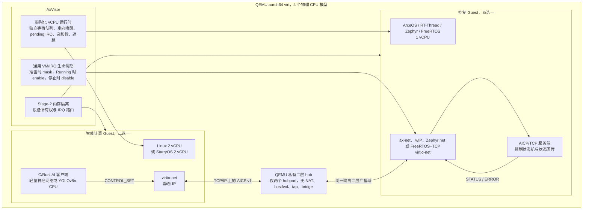
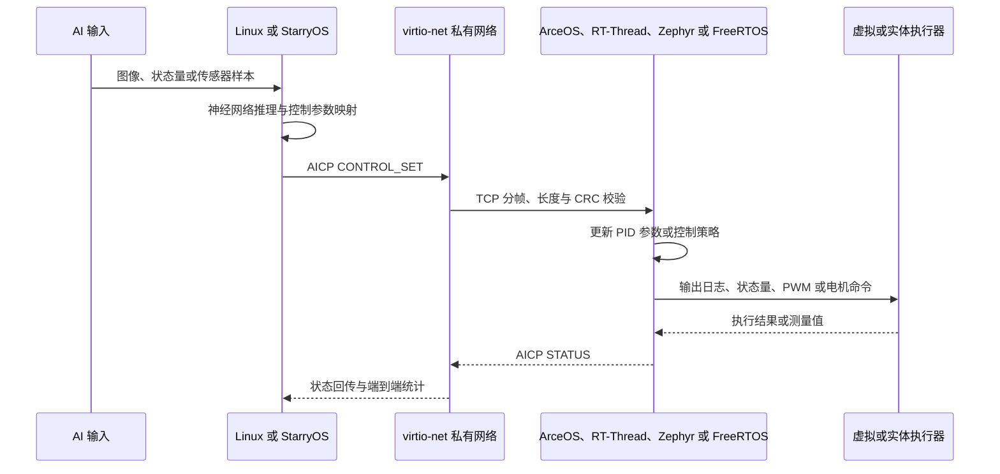
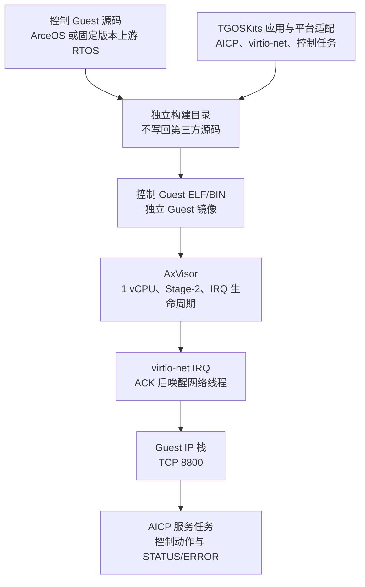
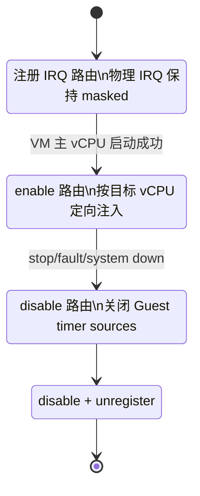
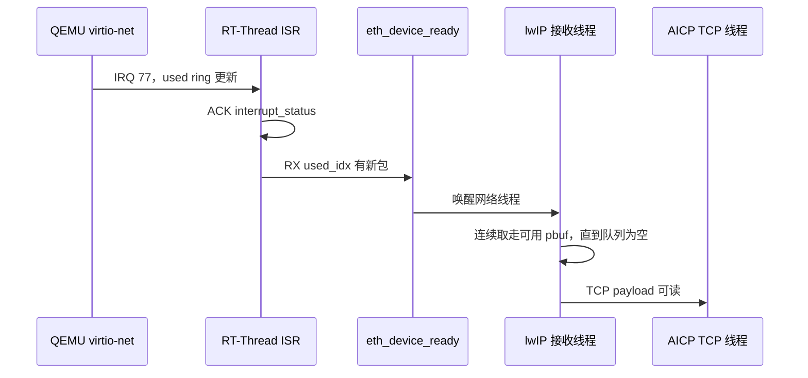
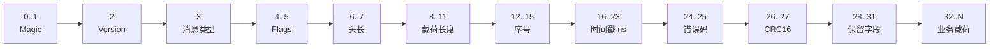
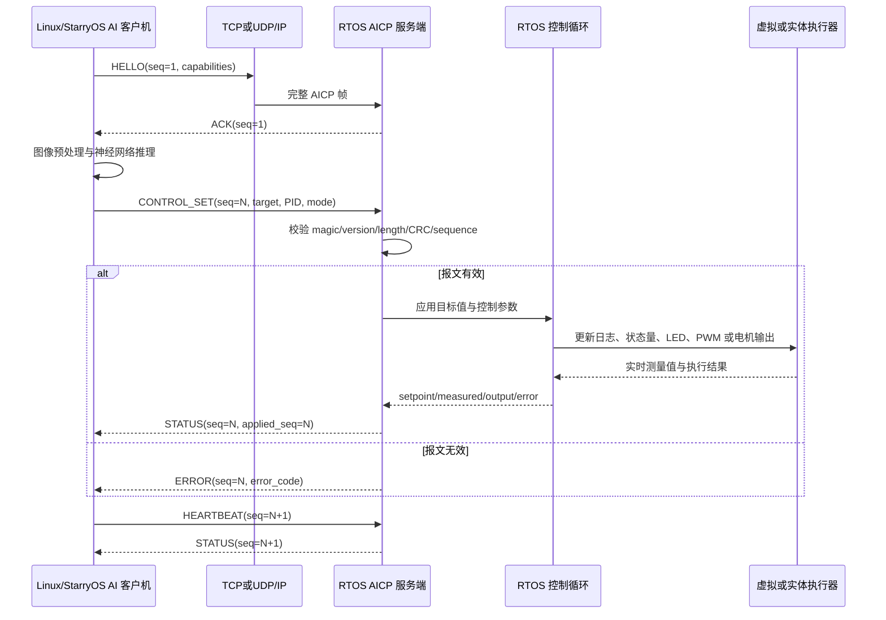
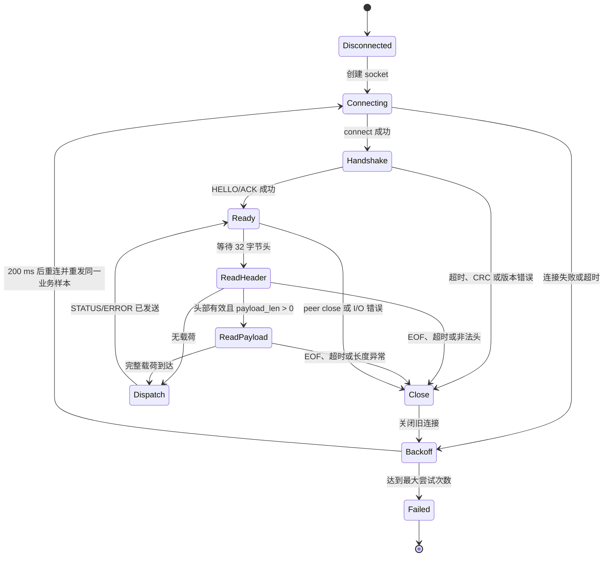
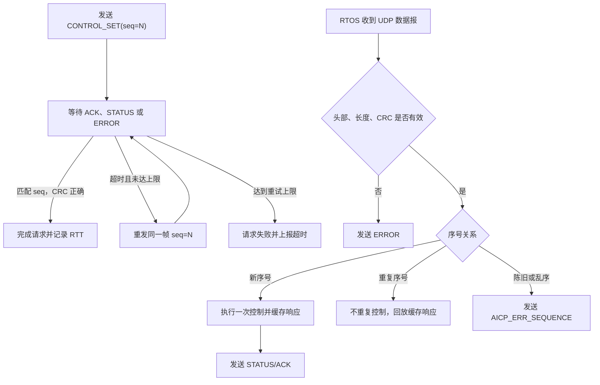
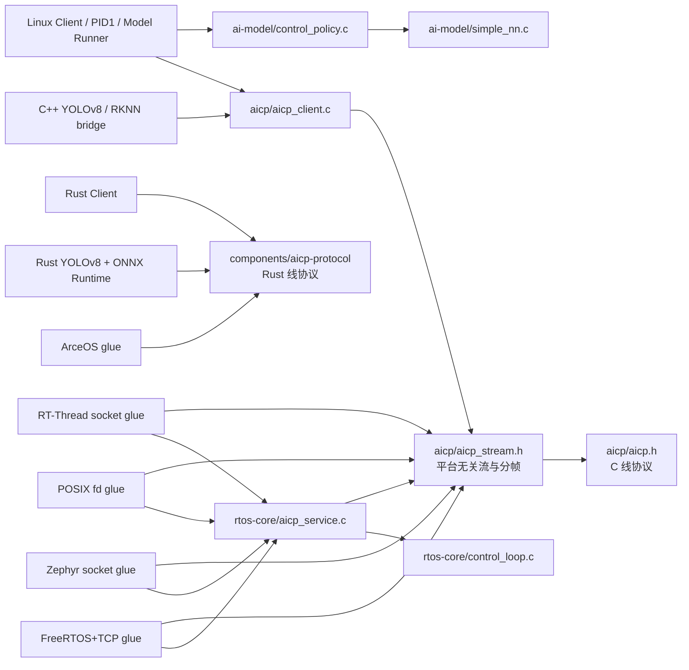

# AxVisor 多客户机智能控制平台技术报告与复现手册

本手册面向开发者、测试人员和评审人员，完整说明系统架构、客户机配置、代码实现、通信协议、智能推理、实时性改造、测试结果、复现步骤、许可证和演示流程。设计、实现、测试与交付信息集中在这一份文档中，所有结论以源码、配置、自动化脚本和严格成功标记为依据。

## 一、交付范围

平台同时保留 Linux 和 StarryOS 两种智能计算 Guest，并为它们与四种控制 Guest 提供八组 QEMU 双 Guest 配置与运行入口：

1. Linux 2-vCPU Guest + ArceOS Guest，AICP/TCP。
2. Linux 2-vCPU Guest + RT-Thread v5.2.1 Guest，AICP/TCP。
3. Linux 2-vCPU Guest + Zephyr v4.4.0 Guest，AICP/TCP。
4. Linux 2-vCPU Guest + FreeRTOS Guest，AICP/TCP。
5. StarryOS Guest + ArceOS Guest，AICP/TCP。
6. StarryOS Guest + RT-Thread v5.2.1 Guest，AICP/TCP。
7. StarryOS Guest + Zephyr v4.4.0 Guest，AICP/TCP。
8. StarryOS Guest + FreeRTOS Guest，AICP/TCP。

ArceOS AICP 服务端既是参考实现，也是八组矩阵中的正式控制 Guest；UDP 路径仅用于 ACK、重传、重复包和乱序处理等故障注入，不替代主线 TCP/IP 数据通道。Linux 中的 Rust YOLOv8n + ONNX Runtime CPU 已在 Linux–ArceOS 拓扑完成图片推理、AICP/TCP、控制输出和 STATUS 回传；RKNN/NPU 板级代码和构建入口已实现。

### 1.1 六类系统支持矩阵

矩阵列出实现与运行入口；已执行 QEMU 验证的精确组合和数据见第五章与同目录《测试报告》。

| 系统 | 角色 | AxVisor/QEMU | IP 网络 AICP | AI 控制闭环 | 实时基线 | 验证结论 |
| --- | --- | --- | --- | --- | --- | --- |
| Linux | 2-vCPU 智能计算 Guest | 已执行 Linux–ArceOS、Linux–FreeRTOS 和 Linux–ArceOS YOLOv8n | AICP/TCP 客户端 | C 轻量神经网络；Rust YOLOv8n CPU | 作为被测多核 Guest | 主演示路径 |
| StarryOS | Linux 替代智能计算 Guest | 构建与运行入口 | AICP TCP/UDP 客户端 | 原生 AICP 控制映射 | 不作为原生 RTOS 基线 | 扩展路径 |
| ArceOS | 独立 Rust 控制 Guest；AICP 参考服务端 | 已执行 standalone、Linux 轻量网络和 YOLOv8n | virtio-net + TCP/UDP | CONTROL_SET、STATUS、ERROR | 用于 AxVisor idle 回归拓扑 | 主控制路径 |
| RT-Thread | 独立原生 RTOS 控制 Guest | 构建与运行入口 | lwIP + TCP | AICP 控制状态机与回传 | 周期基线程序 | 扩展路径 |
| Zephyr | 独立原生 RTOS 控制 Guest | 构建与运行入口 | Zephyr TCP/IP | AICP 控制状态机与回传 | 周期基线程序 | 扩展路径 |
| FreeRTOS | 独立原生 RTOS 控制 Guest | 已执行 Linux 轻量网络闭环 | FreeRTOS+TCP + virtio-net | AICP 控制状态机与回传 | 周期基线程序 | 主演示路径 |

Linux 与 StarryOS 的 AICP 客户端、ArceOS、RT-Thread、Zephyr、FreeRTOS 的控制 Guest 和八组 TCP/IP 配置均保留在本分支。当前 QEMU 实测主线为 Linux–ArceOS、Linux–FreeRTOS，以及 Linux–ArceOS YOLOv8n；RT-Thread、Zephyr、StarryOS 和原生 RTOS 周期基线可按第六章命令独立复现。

### 1.2 验证状态定义

| 等级 | 含义 |
| --- | --- |
| 已实测 | 自动化脚本在 QEMU 中完成运行并出现严格成功标记，文档保留关键日志和统计结果 |
| 待上板 | 依赖 RK3588 NPU、物理网口、GPIO/PWM、电机、逻辑分析仪或真实开发板时钟的验证 |
| 外部流程 | PR 创建、上游合并和演示视频录制等不属于 QEMU 功能验证的交付事项 |

### 1.3 第三方源码边界

Zephyr、RT-Thread、FreeRTOS/FreeRTOS+TCP 均按固定上游版本作为只读依赖。网络服务、AICP 协议、控制环和板级适配放在 `apps/ai-rtos-demo/`；设备树覆盖、Guest TOML 和启动参数放在 TGOSKits 自有配置目录；构建过程只写独立 build 目录。不得为了通过构建或测试直接修改第三方内核、网络栈或驱动源码。

Zephyr 使用官方 `v4.4.0` 源码和官方 `virtio-mmio`、`virtio-net` 驱动。RT-Thread 使用官方 `v5.2.1`，构建脚本复制 `bsp/qemu-virt64-aarch64` 到 `tmp/rtthread-*build` 后再加入 AICP 应用和板级 virtio 适配，因此不会写回上游工作树。FreeRTOS 网络 Guest 遵守同一规则，适配代码放入 `apps/ai-rtos-demo/freertos/`，不直接修改 `FreeRTOS-Kernel` 或 `FreeRTOS+TCP`。

第三方源码边界检查命令：

```sh
scripts/ai-rtos/check_third_party_sources_clean.sh
```

检查器要求 Zephyr 和 RT-Thread 位于指定 tag/commit，所有已初始化的 Zephyr modules 也必须 clean。构建脚本在构建前和退出时重复检查，任何第三方差异都会使流程失败。若单独准备 FreeRTOS 源码树，使用 `FREERTOS_SOURCE_DIR` 和可选的 `FREERTOS_REQUIRED_REF` 将其纳入同一检查。

### 1.4 交付物组成

| 类型 | 位置 | 内容 |
| --- | --- | --- |
| 技术报告与复现手册 | `docs/ai-rtos/完整全流程实现与复现手册.md` | 架构、实现、测试、复现、评分映射、许可证和演示流程 |
| 开发记录与问题排查 | `docs/ai-rtos/开发记录与问题排查.md` | 逐文件代码走读、设计取舍、故障现象、根因、修复和调试命令；作为维护资料，不替代对外技术报告 |
| 智能控制应用 | `apps/ai-rtos-demo/` | AICP 协议、Linux 客户端、Rust YOLOv8n、RT-Thread、Zephyr、FreeRTOS 控制端 |
| StarryOS 实现 | `os/StarryOS/`、`apps/starry/aicp-control/` | 原生智能控制客户端、网络系统调用和镜像注入 |
| AxVisor 实时化 | `virtualization/axvm/`、`os/axvisor/` | vCPU 等待、定向唤醒、IRQ 路由、生命周期、亲和性与实时追踪 |
| 客户机配置 | `os/axvisor/configs/`、`configs/ai-rtos/` | VM TOML、设备树、内存、设备与中断分配 |
| 自动化脚本 | `scripts/ai-rtos/` | 构建、启动、可靠性、长稳、实时 A/B、基线、隔离与结果采集 |
| 运行产物 | `tmp/ai-rtos/` | 镜像、日志、CSV 和 summary；不作为源代码提交内容 |

## 二、系统架构



RT-Thread 和 Zephyr 路径使用 `10.0.2.14/24` 与 `10.0.2.15/24`；FreeRTOS 和 ArceOS 路径使用 `10.0.3.3/24` 与 `10.0.3.2/24`。AI Guest MAC 固定为 `52:54:00:aa:03:03`，控制 Guest MAC 固定为 `52:54:00:aa:03:02`。Linux、StarryOS 和四种控制 Guest 均保留，运行脚本按组合生成独立 VM 配置和镜像。

### 2.1 六类系统架构对比

| 系统 | 系统性质与角色 | CPU 配置 | 内存与入口 | 网络与设备 | 智能计算或控制职责 | QEMU 验证 |
| --- | --- | --- | --- | --- | --- | --- |
| Linux | 完整 Linux 内核，主智能计算 Guest | 2 vCPU；Linux 组合绑定 pCPU1、pCPU2 | `0x80000000`，512 MiB；入口 `0x80200000` | virtio-net `0x0a003c00`；静态 IPv4；AICP/TCP | C 轻量神经网络、C++/Rust YOLOv8n ONNX Runtime CPU，发送模型输出并接收 STATUS | Linux–ArceOS、Linux–FreeRTOS 和 YOLOv8n–ArceOS 已执行 |
| StarryOS | 独立 Rust OS，Linux 替代智能计算 Guest | 2 vCPU；绑定 pCPU0、pCPU1 | `0x80000000`，512 MiB；入口 `0x80200000` | virtio-net；静态 IPv4；AICP/TCP，扩展路径支持 AICP/UDP | 原生轻量神经网络控制映射、协议客户端、网络系统调用与状态回传 | 构建与运行入口 |
| ArceOS | 独立 Rust 控制 Guest | 1 vCPU；Linux 组合绑定 pCPU0，StarryOS 组合绑定 pCPU2 | 独立 Guest RAM 与入口，按生成的 VM TOML 装载 | ax-net + virtio-net；静态 IPv4；AICP/TCP | 公共 AICP 服务状态机、控制执行、STATUS/ERROR | standalone、Linux 轻量网络和 YOLOv8n 已执行 |
| RT-Thread | 独立原生 RTOS 控制 Guest | 1 vCPU；Linux 组合绑定 pCPU0，StarryOS 组合绑定 pCPU2 | `0xC0000000`，256 MiB；入口 `0xC0080000` | virtio-mmio `0x0a003a00`，IRQ 77；lwIP 2.0.3 + SAL | AICP/TCP 服务端、控制状态机、虚拟执行器日志、STATUS/ERROR | 构建与运行入口 |
| Zephyr | 独立原生 RTOS 控制 Guest | 1 vCPU；Linux 组合绑定 pCPU0，StarryOS 组合绑定 pCPU2 | `0xD0000000`，128 MiB；入口 `0xD0001104` | virtio-mmio `0x0a003a00`，IRQ 77；Zephyr TCP/IP | AICP/TCP 服务端、CONTROL_SET、STATUS、ERROR、重连 | 构建与运行入口 |
| FreeRTOS | 独立原生 RTOS 控制 Guest | 1 vCPU；Linux 组合绑定 pCPU0，StarryOS 组合绑定 pCPU2 | `0xD0000000`，128 MiB；入口 `0xD0001000` | virtio-mmio `0x0a003a00`，IRQ 77；FreeRTOS+TCP | AICP/TCP 服务端、控制任务、STATUS/ERROR、重连 | Linux 主线已执行 |

### 2.2 两种双 Guest 资源拓扑

| 拓扑 | 智能计算 Guest | 控制 Guest | pCPU 分配 | 内存隔离 | 设备与中断 |
| --- | --- | --- | --- | --- | --- |
| Linux + 控制 Guest | Linux，2 vCPU | ArceOS、RT-Thread、Zephyr 或 FreeRTOS，1 vCPU | 控制 Guest 使用 pCPU0；Linux vCPU0/vCPU1 使用 pCPU1/pCPU2 | Linux RAM 为 `0x80000000` 起始的 512 MiB；控制 Guest 使用独立 RAM 区域；Stage-2 页表隔离 | 两张 virtio-net 分属不同 VM，通过私有 QEMU hub 相连；控制 Guest 网卡 IRQ 定向路由到 pCPU0 |
| StarryOS + 控制 Guest | StarryOS，2 vCPU | ArceOS、RT-Thread、Zephyr 或 FreeRTOS，1 vCPU | StarryOS vCPU0/vCPU1 使用 pCPU0/pCPU1；控制 Guest 使用 pCPU2 | StarryOS RAM 为 `0x80000000` 起始的 512 MiB；控制 Guest 使用独立 RAM 区域；Stage-2 页表隔离 | 两张 virtio-net 分属不同 VM，通过私有 QEMU hub 相连；控制 Guest 网卡 IRQ 定向路由到 pCPU2 |

Linux 使用不少于 2 个 vCPU，满足多核客户机要求。两种拓扑都避免把智能计算任务和实时控制 Guest 放在同一 pCPU 上竞争；AxVisor 根据 VM 配置中的 `phys_cpu_ids` 建立 vCPU 到 pCPU 的有效亲和性，并据此设置设备 IRQ 路由。

### 2.3 八组部署矩阵

| 智能计算 Guest | ArceOS | RT-Thread | Zephyr | FreeRTOS |
| --- | --- | --- | --- | --- |
| Linux 2-vCPU | AICP/TCP，已执行（含 YOLOv8n） | AICP/TCP，运行入口 | AICP/TCP，运行入口 | AICP/TCP，已执行 |
| StarryOS 2-vCPU | AICP/TCP，运行入口 | AICP/TCP，运行入口 | AICP/TCP，运行入口 | AICP/TCP，运行入口 |

八种组合使用同一 AICP v1 语义：智能计算端完成输入处理和模型推理，发送 `CONTROL_SET`；控制 Guest 执行控制计算并返回 `STATUS`，协议错误返回 `ERROR`。切换 Guest 只替换镜像、网络栈适配和 VM 配置，不改变 AxVisor 公共 IRQ 生命周期与协议定义。

### 2.4 闭环时序



## 三、控制客户机架构与启动流程

四种控制端都以独立镜像启动为 AxVisor Guest，不是在 Linux、StarryOS 或宿主系统中运行的用户态程序。AxVisor 为每个控制 Guest 分配独立 vCPU、Guest RAM、virtio-mmio 网卡和 IRQ 路由；Guest 自己的调度器、网络线程和控制任务直接运行在独立内核中。RT-Thread、Zephyr 和 FreeRTOS 是原生 RTOS；ArceOS 是独立 Rust 内核控制 Guest，同时承担 AICP 参考服务端和实时 A/B 验证角色。



### 3.1 四种控制 Guest 横向对比

| 对比项 | ArceOS | RT-Thread v5.2.1 | Zephyr v4.4.0 | FreeRTOS 固定提交 |
| --- | --- | --- | --- | --- |
| 源码策略 | TGOSKits 内部应用，直接复用 ArceOS/ax-net | 官方源码只读；复制 BSP 到独立构建目录 | 官方源码和 modules 只读；应用在仓库目录，使用 west 独立 build | FreeRTOS-Kernel 与 FreeRTOS+TCP 只读；平台层在仓库目录 |
| Guest 产物 | `arceos-aicp-server.bin` | `rtthread.elf`、`rtthread.bin` | `zephyr.elf`、`zephyr.bin` | `aicp-freertos.elf`、`aicp-freertos.bin` |
| 任务模型 | ArceOS 任务 + ax-net socket | RT-Thread 线程 + lwIP 网络线程 + SAL socket | Zephyr thread + 原生 socket API | FreeRTOS task + IP task + FreeRTOS+TCP socket |
| 网络栈 | ax-net | lwIP 2.0.3 + SAL | Zephyr TCP/IP | FreeRTOS+TCP |
| 网卡适配 | ArceOS virtio-net 驱动 | `drv_virtio_aicp.c`，中断唤醒为主 | 官方 virtio 框架 + 仓库侧 legacy virtio-mmio 适配 | `NetworkInterface.c` + `virtio_net.c` |
| RX 策略 | IRQ 唤醒网络服务，阻塞 socket 等待业务帧 | IRQ 77 ACK 后调用 `eth_device_ready()`，lwIP 线程排空队列；启动期有限 watchdog | IRQ 通知网络线程；短周期恢复扫描只处理遗漏 completion | IRQ 通知 RX task；20 ms fallback 只用于丢中断恢复；Idle Task 执行 WFI |
| AICP 服务 | TCP 主线；控制、状态、错误、重复和陈旧序号处理 | 阻塞 `accept/recv`，控制、状态、错误、重复和陈旧序号处理 | 阻塞 socket，控制、状态、错误和断线重连 | 阻塞 socket，控制、状态、错误和断线重连 |
| 控制动作 | `AICP_RTOS_CONTROL` 日志与 STATUS 回传 | `AICP_RTTHREAD_CONTROL` 日志与 STATUS 回传 | 控制状态更新与 STATUS 回传 | `AICP_FREERTOS_CONTROL` 日志与 STATUS 回传 |
| 实时/周期验证 | AxVisor 实时 A/B 与 10000 次长稳 | 20 ms，空载/压力各 1000 样本 | 20 ms，空载/压力各 1000 样本 | 20 ms，空载/压力各 1000 样本 |

### 3.2 构建与装载入口

| 控制 Guest | 应用与适配目录 | 构建脚本 | AxVisor 装载参数 |
| --- | --- | --- | --- |
| ArceOS | `apps/arceos/aicp-server/` | `scripts/ai-rtos/setup_qemu_rtos.sh arceos-aicp` | 由 `tmp/ai-rtos/arceos-aicp-qemu.generated.toml` 固化 RAM、入口、设备和 IRQ |
| RT-Thread | `apps/ai-rtos-demo/rtthread-aicp/` | `scripts/ai-rtos/build_rtthread_aicp_guest.sh` | RAM `0xC0000000`/256 MiB，入口 `0xC0080000` |
| Zephyr | `apps/ai-rtos-demo/zephyr/` | `scripts/ai-rtos/build_zephyr_aicp_guest.sh` | RAM `0xD0000000`/128 MiB，入口 `0xD0001104` |
| FreeRTOS | `apps/ai-rtos-demo/freertos/` | `scripts/ai-rtos/build_freertos_aicp_guest.sh` | RAM `0xD0000000`/128 MiB，入口 `0xD0001000` |

RT-Thread、Zephyr、FreeRTOS 三条外部 RTOS 构建链都把协议应用和平台适配加入生成目录或独立工程，不改动上游内核、网络栈和通用驱动源码。ArceOS 服务端位于 TGOSKits 自有应用目录。`scripts/ai-rtos/check_third_party_sources_clean.sh` 在构建前后检查外部 RTOS 的固定版本和工作树洁净状态。

## 四、具体代码修改

### 代码实现总览

| 模块 | 主要文件 | 实现职责 |
| --- | --- | --- |
| AxVisor 实时运行时 | `virtualization/axvm/src/runtime/vcpus.rs`、`runtime/rt_trace.rs`、`runtime/lifecycle.rs`、`vm.rs` | 每 vCPU 等待队列、定向唤醒、pending IRQ、生命周期 hook、实时追踪与停止清理 |
| AArch64 IRQ 路径 | `virtualization/axvm/src/runtime/aarch64_irq.rs`、`arch/aarch64/mod.rs`、`host/gic.rs`、`os/axvisor/src/platform_irq.rs` | 物理 IRQ 注册、mask/enable/disable、VM 状态检查、vCPU/pCPU 亲和性和定向注入 |
| 通用平台 IRQ API | `platforms/ax-plat/src/irq.rs`、`platforms/axplat-dyn/src/irq.rs`、`platforms/somehal/src/irq.rs`、`drivers/intc/arm-gic-driver/` | 为生命周期管理提供跨平台 IRQ 控制能力，不按 Guest 名称分支 |
| VM 配置与资源准备 | `virtualization/axvm/src/config.rs`、`vm/prepare/devices.rs`、`vm/prepare/vcpus.rs`、`os/axvisor/src/config.rs` | 解析 CPU 亲和性、内存、设备和 IRQ，建立有效 CPU mask 与资源所有权 |
| AICP v1 线协议 | `apps/ai-rtos-demo/aicp/aicp.h`、`components/aicp-protocol/src/lib.rs` | C/Rust 公共编解码、32 字节头、网络字节序、消息类型、序号、时间戳、错误码和 CRC；不依赖具体 OS API |
| AICP C 平台无关流与分帧 | `apps/ai-rtos-demo/aicp/aicp_stream.h` | 用 read/write capability 实现 TCP 完整读写、EOF、规范化负 errno 和 AICP 帧收发；不包含 OS 条件编译 |
| AICP C 数据报编解码 | `apps/ai-rtos-demo/aicp/aicp_datagram.h` | 对 UDP 单报文执行公共头编码、精确长度检查、buffer 边界检查和 CRC 校验，拒绝截断、尾随字节及损坏报文 |
| AICP POSIX 流适配 | `apps/ai-rtos-demo/aicp/aicp_posix_stream.h` | 连接 Linux、StarryOS、主机工具、C++ YOLOv8 和 RKNN bridge 的 fd/read/write |
| AICP C 客户端事务 | `apps/ai-rtos-demo/aicp/aicp_client.c`、`aicp_client.h` | Linux PID1、普通 C Client、C++ YOLOv8 与 RKNN bridge 共用 HELLO、CONTROL_SET、STATUS/ERROR、序号校验和 RTT 采样 |
| AICP 服务状态机 | `apps/ai-rtos-demo/rtos-core/aicp_service.c`、`aicp_service.h` | HELLO、CONTROL、STATUS、ERROR、重复回放、陈旧序号拒绝和统计；通过回调取得时间并报告 OS 相关事件 |
| Linux 智能计算端 | `apps/ai-rtos-demo/linux-client/main.c`、`linux-init/aicp_init.c`、`yolov8-init/aicp_yolov8_init.c` | 静态网络、AICP 客户端、PID1 启动、重连、时延统计和结果验收 |
| StarryOS 智能计算端 | `os/StarryOS/starryos/src/native_aicp.rs`、`apps/starry/aicp-control/` | 原生轻量神经网络控制映射、AICP/TCP 与 UDP 客户端、状态回传 |
| StarryOS 网络能力 | `os/StarryOS/kernel/src/file/net.rs`、`kernel/src/syscall/net/`、`net/ax-net/src/`、`drivers/ax-driver/src/virtio/net.rs` | socket I/O、网络 ioctl、收包唤醒、静态地址和 virtio-net 配置传播 |
| RT-Thread 控制端 | `apps/ai-rtos-demo/rtthread-aicp/main.c`、`drv_virtio_aicp.c` | lwIP/SAL、virtio-net、IRQ 77、AICP 服务、控制动作、重复/陈旧包和统计 |
| Zephyr 控制端 | `apps/ai-rtos-demo/zephyr/src/main.c`、`virtio_mmio_legacy.c`、`axvisor-virtio.overlay` | Zephyr TCP/IP、virtio-mmio、AICP 服务、异常恢复和周期基线 |
| FreeRTOS 控制端 | `apps/ai-rtos-demo/freertos/main.c`、`NetworkInterface.c`、`virtio_net.c`、`platform.c`、`boot.S` | FreeRTOS+TCP 网络接口、AICP 服务、EL2/EL1 启动归一化、GIC/timer 和周期基线 |
| 通用控制算法 | `apps/ai-rtos-demo/rtos-core/control_loop.c`、`control_loop.h` | 将模型输出映射为控制参数，维护控制状态并形成 STATUS 载荷 |
| 轻量神经网络与控制策略 | `apps/ai-rtos-demo/ai-model/simple_nn.c`、`control_policy.c` 及对应头文件 | 前者负责固定权重推理与目标轨迹，后者统一生成 fixed/ai AICP 控制参数，供 Linux Client、Linux/Starry 初始化程序和模型对照程序共同链接 |
| Rust 协议公共 crate | `components/aicp-protocol/` | 默认 `no_std` 的 AICP 线格式、CRC 和校验；`std` feature 提供 TCP 分帧收发，供普通 Rust Client 与 Rust YOLOv8 共用 |
| Rust YOLOv8n CPU | `apps/ai-rtos-demo/yolov8-rust-onnx/src/main.rs`、`ffi/ort_shim.c` | JPEG 预处理、ONNX Runtime CPU 推理、YOLO 后处理、NMS、控制映射和 AICP/TCP |
| C++ YOLOv8n CPU | `apps/ai-rtos-demo/yolov8-onnx-cpu/src/main.cc` | ONNX Runtime CPU 推理与 AICP 控制闭环的第二种实现 |
| RKNN/NPU 板级路径 | `apps/starry/orangepi-5-plus-uvc-rknn/rknn-yolov8-image/cpp/aicp_bridge.cc`、`aicp_main.cc` | RK3588 RKNN 推理结果到 AICP 控制参数的桥接；QEMU 不执行 `.rknn` |
| Guest 配置 | `configs/ai-rtos/`、`os/axvisor/configs/vms/qemu/aarch64/` | vCPU/pCPU、内存、入口、设备映射、中断、设备树保留区与启动参数 |
| 自动化验证 | `scripts/ai-rtos/` | 八组闭环、可靠性、故障注入、实时 A/B、长稳、RTOS 基线、隔离和结果汇总 |

### 4.1 AxVisor 实时化

主要文件：

- `virtualization/axvm/src/runtime/vcpus.rs`
- `virtualization/axvm/src/runtime/lifecycle.rs`
- `virtualization/axvm/src/vm.rs`
- `virtualization/axvm/src/runtime/rt_trace.rs`
- `virtualization/axvm/src/vm/prepare/devices.rs`
- `virtualization/axvm/src/arch/aarch64/mod.rs`
- `virtualization/axvm/src/host/arceos.rs`
- `os/axvisor/src/config.rs`
- `os/axvisor/src/manager.rs`

实现内容：

1. 为每个 vCPU 建立独立等待队列，vCPU 阻塞时只睡眠在自己的队列上。
2. 设备中断到来时按目标 vCPU 定向唤醒，避免全 VM `notify_all` 引起惊群和无关 vCPU 抢占。
3. 为每个 vCPU 建立 pending IRQ 队列，在进入 Guest 前集中注入，减少锁竞争和跨路径重复查询。
4. VM 停止等全局状态仍使用全局等待队列，避免把局部优化错误扩散到 VM 生命周期管理。
5. `phys_cpu_ids` 转换为有效 CPU mask，并与 AxVM 已初始化 CPU mask 求交；配置错误时给出可见告警和确定性回退。
6. 增加 vCPU affinity、wake-to-run、VM-exit、宿主 IRQ dispatch/handler 的低频统计 marker。
7. 保留旧共享等待队列基线和优化路径，用同一套脚本做 A/B 测试，而不是拿不同负载或不同镜像比较。
8. 修复 GPPT GICD 直通 IRQ 的 CPU affinity 计算：从真实 vCPU 到 pCPU 映射取得目标，而不是使用 `vm.id() - 1` 推导。
9. 新增通用 VM 生命周期 hook。VM 准备阶段注册由设备树、设备所有权、VM/vCPU/pCPU 亲和性推导出的物理 IRQ 路由，但保持物理 IRQ masked；VM 进入 Running 后统一 enable，进入 Stopping 后统一 disable，删除 VM 时执行 disable + unregister。
10. AArch64 透传 IRQ 到达时再次检查 VM 状态。目标 VM 不是 Running 或 Paused 时立即 mask 对应物理 IRQ，避免 Guest 已退出而设备或定时器继续触发导致宿主 IRQ 风暴。
11. vCPU 任务退出时关闭 Guest timer sources，防止架构定时器在 vCPU 上下文销毁后继续注入私有 IRQ。

IRQ 路由不包含 `linux`、`starry`、`rtthread`、`zephyr` 或 `freertos` 名称分支。Guest 类型只影响自己的镜像、设备树和网络栈；AxVisor 公共层始终依据 VM 配置、设备树中断描述和 CPU 亲和性工作，因此增加新的 Guest 不需要再修改公共 IRQ 路由逻辑。



### 4.2 RT-Thread virtio-net、IRQ 和 DMA

主要文件：

- `apps/ai-rtos-demo/rtthread-aicp/drv_virtio_aicp.c`
- `configs/ai-rtos/qemu-aarch64-rtthread-reserved-memory-overlay.dts`
- `scripts/ai-rtos/build_rtthread_aicp_guest.sh`
- `scripts/ai-rtos/run_axvisor_linux_rtthread_aicp.sh`

实现内容：

1. 扫描指定的 virtio-mmio 槽位，只初始化 RT-Thread 拥有的网卡。
2. 安装 GICv3 IRQ 77 ISR；ISR 先 ACK virtio 中断，再检查 RX used ring，并调用 `eth_device_ready()` 唤醒 RT-Thread 网络接收线程。
3. RX/TX 包统计通过包裹原始 `eth_rx`/`eth_tx` 回调实现，不改变 lwIP 的收发语义。
4. 启动阶段运行有限轮次 IRQ watchdog，只用于诊断和恢复“pending 已存在但 IRQ 未重新使能”的早期配置问题；主数据路径依赖中断，不做持续忙轮询。
5. RT-Thread virtqueue 描述符保存 Guest 物理地址，而 QEMU 直通设备不会经过 AxVisor Stage-2 地址翻译，因此为 RT-Thread 预留并身份映射 `0xC0000000..0xCFFFFFFF`。
6. RT-Thread v5.2.1 的 `struct virtio_net_hdr` 固定包含 `num_buffers`，大小为 12 字节；QEMU `mrg_rxbuf=off` 时设备只写 10 字节头，曾导致以太帧整体错 2 字节。最终 RT-Thread 网卡显式使用 `mrg_rxbuf=on`，驱动与设备共同协商 mergeable RX；Linux 网卡继续使用 `mrg_rxbuf=off`。运行脚本会检查这两个参数。

### 4.3 中断触发与 poll 设计

网络接收方案采用 Linux/RTOS 驱动常见的“中断通知 + 线程排空队列”结构：



virtio-mmio 的中断状态需要 ACK，ISR 本身只做常数级工作，不在中断上下文解析 TCP/AICP。lwIP 网络线程被唤醒后排空现有 RX 包，因此即使一次通知对应多个包也不会只处理一个包就睡回去。服务端 `accept()`/`recv()` 是阻塞 socket，不是无界忙 `poll`。有限轮次 watchdog 不属于主数据通道，只是启动诊断保护。

### 4.4 AICP v1 协议

主要文件：

- `apps/ai-rtos-demo/aicp/aicp.h`
- `apps/ai-rtos-demo/aicp/aicp_stream.h`
- `apps/ai-rtos-demo/aicp/aicp_posix_stream.h`
- `components/aicp-protocol/src/lib.rs`
- `apps/ai-rtos-demo/rtos-core/aicp_service.c`
- `apps/ai-rtos-demo/rtos-core/aicp_service.h`

AICP 固定头为 32 字节，采用网络字节序。字段包括 magic、版本、消息类型、flags、头长、载荷长、序号、时间戳、错误码、CRC16-CCITT 和保留字段。CRC 计算时先把头部的 CRC 字段置零，再依次覆盖 32 字节头部和完整载荷。

`aicp.h` 只定义线格式、编解码和 CRC，不包含线程、socket、时钟或日志 API。`aicp_stream.h` 在此之上定义平台无关 read/write capability、完整读写和 AICP 分帧；回调只返回字节数、断连或规范化负 errno。`aicp_posix_stream.h` 负责 POSIX fd 适配，RT-Thread、Zephyr 和 FreeRTOS 则在各自入口中连接本系统 socket API。`aicp_service.c` 是 C 控制端唯一的公共服务状态机，不感知 `int`、`Socket_t` 或任何具体 OS。Rust 端复用 `components/aicp-protocol`，避免在 Rust Client、Rust YOLOv8 和 ArceOS 之间复制头布局与 CRC 规则。

#### 4.4.1 固定头布局

```text
字节偏移   0               1               2               3
         +---------------+---------------+---------------+---------------+
0x00     | Magic (16 bit, 0x4149)         | Version       | Message Type  |
         +---------------+---------------+---------------+---------------+
0x04     | Flags (16 bit)                 | Header Length (16 bit, 32)     |
         +---------------+---------------+---------------+---------------+
0x08     | Payload Length (32 bit)                                        |
         +---------------+---------------+---------------+---------------+
0x0c     | Sequence Number (32 bit)                                       |
         +---------------+---------------+---------------+---------------+
0x10     | Timestamp ns (64 bit, high 32 bit)                             |
         +---------------+---------------+---------------+---------------+
0x14     | Timestamp ns (64 bit, low 32 bit)                              |
         +---------------+---------------+---------------+---------------+
0x18     | Error Code (16 bit)           | CRC16-CCITT (16 bit)           |
         +---------------+---------------+---------------+---------------+
0x1c     | Reserved (32 bit, must be zero)                                |
         +---------------+---------------+---------------+---------------+
```



| 字段 | 宽度 | 约束与用途 |
| --- | ---: | --- |
| Magic | 16 bit | 固定为 `0x4149`，用于快速拒绝非 AICP 报文 |
| Version | 8 bit | v1 固定为 `1`，版本不匹配返回 `AICP_ERR_VERSION` |
| Message Type | 8 bit | 区分 HELLO、ACK、CONTROL_SET、STATUS、ERROR、HEARTBEAT |
| Flags | 16 bit | ACK、重传或扩展语义标志 |
| Header Length | 16 bit | v1 固定为 `32` |
| Payload Length | 32 bit | 载荷字节数，必须不超过 `AICP_MAX_PAYLOAD` |
| Sequence | 32 bit | 请求关联、去重、乱序和重放控制，支持无符号环绕比较 |
| Timestamp | 64 bit | 发送侧单调时钟纳秒值，用于 RTT 和端到端延迟统计 |
| Error Code | 16 bit | 成功为 `AICP_OK`，错误响应携带具体原因 |
| CRC16 | 16 bit | CRC16-CCITT，覆盖 CRC 清零后的头部和载荷 |
| Reserved | 32 bit | v1 必须写零，供后续兼容扩展 |

#### 4.4.2 消息与控制闭环

业务消息覆盖：

- `HELLO`/`ACK`：能力握手。
- `CONTROL_SET`：目标值、PID 参数、前馈量和模式。
- `STATUS`：已应用序号、测量值、误差和控制输出。
- `ERROR`：版本、类型、长度、CRC、序号等错误通知。
- `HEARTBEAT`：活性与状态读取。



#### 4.4.3 TCP 分帧、超时与重连

TCP 是字节流，接收端不能假设一次 `recv()` 正好返回一帧。实现先精确读取 32 字节固定头，校验载荷长度，再循环读取完整载荷；发送端同样循环写到整帧完成。



#### 4.4.4 UDP ACK、重传、重复与乱序处理

UDP 每个数据报承载一帧完整 AICP 报文。客户端为每个业务请求保存序号、序列化帧和重试计数；超时后重发相同序号。服务端缓存最近一次已接受序号和响应：重复序号只回放响应，不再次执行控制；落后于窗口的陈旧序号返回序号错误。



TCP 路径实现固定头分帧、长度上限、完整读写、收发超时、peer close 检测和重连。Linux C 客户端按业务请求执行有界恢复：连接、HELLO 或收发失败时关闭旧连接，等待 200 ms 后重新连接并重发同一业务样本，最多尝试 10 次；只有全部尝试失败才把该业务请求计为失败。RT-Thread 对每个连接维护独立序号状态；重复序号回放上次响应且不重复执行控制动作，陈旧序号返回 `AICP_ERR_SEQUENCE`，32 位序号比较支持环绕。

自动化协议回归的最终结果为：协议单元测试 12/12；普通 TCP 冒烟 50/50、failed=0，平均 RTT 421,400 ns、p99 1,262,399 ns、最大 1,576,000 ns；服务端延迟 350 ms 的确定性重连回归 5/5、failed=0。12 项协议用例覆盖公共头、CRC、截断、非法类型以及 UDP 数据报往返、尾随字节拒绝和载荷损坏检测。延迟回归日志明确记录前两次连接超时，随后同一请求重连成功，因此验证的是业务级恢复，而不是仅验证服务端重新 `accept()`。

UDP 路径实现 ACK、超时、重传、重复响应回放和陈旧序号拒绝。vsock、共享内存、HyperCall 和裸 MMIO 均未作为主数据通道。

网络隔离检查器使用 `arceos-tcp`、`rtthread-tcp`、`zephyr-tcp`、`freertos-tcp` 和 `starry-udp` 五种 profile，并通过 `--ai-guest linux|starry` 覆盖八组 TCP 主线和 UDP 故障注入配置。每个拓扑限定为两个连接到同一 `hubid=3` 的 QEMU `hubport`，禁止 user-net、hostfwd、tap、bridge、socket、NAT 和宿主网卡；RT-Thread 和 Zephyr profile 还校验 AI Guest 使用 `mrg_rxbuf=off`、控制 Guest 使用 `mrg_rxbuf=on`。检查器的确定性单测覆盖路径误判、外部网络后端拒绝、运行 marker、四类控制 Guest profile 和 ERROR 通知实现。

统一 `full` 验收重新构建了 RT-Thread Guest 和 Linux initramfs，关键日志如下：

```text
[    0.084356] smp: Brought up 1 node, 2 CPUs
AICP_RTTHREAD_NET_UP dev=virtio ip=10.0.2.15 flags=0x2b link=0
AICP_RTTHREAD_READY transport=tcp port=8800
AICP_RTTHREAD_CONTROL seq=11 target_milli=613 measured_milli=469 output_milli=197 mode=1
AICP_LINUX_DONE ok=20 failed=0 avg_rtt_ns=218289549 max_rtt_ns=266852000
```

### 4.5 RT-Thread AICP 服务端和控制动作

`apps/ai-rtos-demo/rtthread-aicp/main.c` 完成：

1. 等待 virtio 网卡注册并设置静态 IP。
2. 创建 TCP socket、设置 `SO_REUSEADDR` 和收发超时、绑定 `0.0.0.0:8800`。
3. 逐连接读取 AICP 帧并验证协议。
4. 将 `CONTROL_SET` 交给 `rtos-core/control_loop.c` 更新控制状态。
5. 打印 `AICP_RTTHREAD_CONTROL`，作为 QEMU 中可观察的虚拟控制动作。
6. 返回 `STATUS`；协议异常返回 `ERROR`。
7. 客户端断线后回到 `accept()`，支持重新连接。
8. 输出连接、断线、控制、错误、重复、陈旧序号、IRQ、RX/TX 帧统计。

### 4.6 Zephyr 与 FreeRTOS AICP 服务端

Zephyr 主要文件：

- `apps/ai-rtos-demo/zephyr/src/main.c`
- `apps/ai-rtos-demo/zephyr/src/virtio_mmio_legacy.c`
- `apps/ai-rtos-demo/zephyr/axvisor-virtio.overlay`
- `scripts/ai-rtos/build_zephyr_aicp_guest.sh`
- `scripts/ai-rtos/run_axvisor_linux_zephyr_aicp.sh`

Zephyr 使用官方 v4.4.0 网络栈和 overlay 中声明的 virtio-mmio 设备。仓库侧 legacy virtio 适配负责队列、IRQ ACK 和有界 completion recovery；AICP 线程监听 TCP 8800，完成 HELLO/ACK、CONTROL_SET/STATUS、ERROR 和断连后重新 accept。所有适配均位于仓库应用目录，没有修改 Zephyr 上游源码。

FreeRTOS 主要文件：

- `apps/ai-rtos-demo/freertos/main.c`
- `apps/ai-rtos-demo/freertos/NetworkInterface.c`
- `apps/ai-rtos-demo/freertos/virtio_net.c`
- `apps/ai-rtos-demo/freertos/platform.c`
- `scripts/ai-rtos/build_freertos_aicp_guest.sh`
- `scripts/ai-rtos/run_axvisor_linux_freertos_aicp.sh`

FreeRTOS+TCP 网络接口由仓库 overlay 的 virtio-net 驱动实现。网络 RX task 使用 IRQ 通知为主、20 ms fallback recovery 为丢中断恢复路径，Idle Task 通过 Idle Hook 执行 WFI，避免空闲忙转；AICP 服务 task 完成协议校验、控制状态更新、STATUS/ERROR 返回和重连。FreeRTOS-Kernel 与 FreeRTOS+TCP 上游目录保持只读。

### 4.7 Linux 与 Rust YOLOv8n

主要文件：

- `apps/ai-rtos-demo/yolov8-rust-onnx/src/main.rs`
- `apps/ai-rtos-demo/yolov8-rust-onnx/ffi/ort_shim.c`
- `apps/ai-rtos-demo/yolov8-init/aicp_yolov8_init.c`
- `scripts/ai-rtos/run_axvisor_rtthread_yolov8_rust_aicp.sh`

Rust 程序使用真实 `yolov8n.onnx` 和 ONNX Runtime CPU Execution Provider，流程为 JPEG 解码、letterbox、NCHW 归一化、推理、YOLOv8 输出解析、置信度过滤、NMS、检测结果到控制参数映射、AICP 发送和 RTOS STATUS 回传。

静态 PID1 启动器通过 `execv()` 启动动态链接的 Rust 程序并传入 RT-Thread 地址、Linux 地址、子网、网卡和静态 ARP MAC。`execv()` 后 Rust 程序仍是 PID 1，因此由它挂载 `/proc`、`/sys` 并在完成后保持 Guest 存活。

### 4.8 StarryOS 智能计算客户机路径

主要文件：

- `os/StarryOS/starryos/src/native_aicp.rs`
- `os/StarryOS/kernel/src/file/net.rs`
- `os/StarryOS/kernel/src/syscall/net/io.rs`
- `os/StarryOS/kernel/src/syscall/net/socket.rs`
- `net/ax-net/src/`
- `drivers/ax-driver/src/virtio/net.rs`

StarryOS 原生 AICP 客户端同时支持两类传输：与 ArceOS、RT-Thread、Zephyr、FreeRTOS 的八组主线均使用 TCP/IP，完成分帧、超时、断连和重连；UDP/IP 作为故障注入扩展，完成 ACK、超时重传、重复回放和乱序拒绝。两类路径都使用静态地址和 ARP。为支持该路径，补充了网络 ioctl、socket I/O、任务/用户内存和 rootfs 注入相关能力，并修复 virtio/ax-net 的收包唤醒和配置传播。StarryOS 是 Linux 之外的附加实现，Linux 路径继续保留。

### 4.9 FreeRTOS 原生周期基线与启动契约

主要文件：

- `apps/ai-rtos-demo/freertos/boot.S`
- `apps/ai-rtos-demo/freertos/platform.c`
- `apps/ai-rtos-demo/freertos/main.c`
- `scripts/ai-rtos/run_freertos_periodic_baseline.sh`

FreeRTOS 同一镜像需要兼容两种标准启动环境：AxVisor 从 EL1 进入 Guest；独立 QEMU 在 `virtualization=on` 时从 EL2 进入 payload。`boot.S` 读取 `CurrentEL`，仅在 EL2 路径设置 `HCR_EL2.RW`、开放 EL1 counter/timer、清零 `CNTVOFF_EL2`、开放浮点状态，并通过 `SPSR_EL2=EL1h + DAIF masked`、`ELR_EL2` 和 `eret` 归一化到 EL1。已经位于 EL1 的 AxVisor Guest 直接走原启动路径，因此不会因基线适配破坏双 Guest 运行。

无固件的独立 QEMU 不会替 RTOS 初始化 GIC Distributor/Redistributor。仅在 `AICP_FREERTOS_BASELINE` 构建中，`platform.c` 取得 GIC 所有权：使能 GICD Group1 和 affinity routing，等待 RWP，清除 GICR `ProcessorSleep` 并等待 `ChildrenAsleep` 清除。AxVisor Guest 构建不执行这个 owner block，共享 GIC 仍由宿主管理。

最初的 tick handler 在每次 IRQ 结束时写 `CNTV_TVAL=tick_cycles`，会把中断处理时间逐周期累积成相位漂移。修复后维护 `next_tick_deadline`，每次执行 `next_tick_deadline += tick_cycles` 并写入 `CNTV_CVAL`，以绝对 deadline 重装定时器。该修改把 20 秒、1000 样本测试中的持续累计漂移消除，同时保留真实压力尖峰和 deadline miss 统计。

### 4.10 AI 演示工程的公共代码边界

`apps/ai-rtos-demo/` 不按 Linux、StarryOS 或某个 RTOS 名称复制协议和算法。公共层只依赖标准 C、`core` 或显式 capability，操作系统差异留在各自入口和驱动适配中。



`components/aicp-protocol` 将时间源留给调用者：应用取得 wall-clock 或 monotonic 时间后传入 `Header::new()`，协议核心不绑定 Linux 系统调用。其默认构建为 `no_std`，开启 `std` feature 后才提供基于 `Read/Write` 的 TCP 分帧函数。协议 crate 的单元测试覆盖 Header 往返、已知 CRC 向量、错误 magic、错误版本、错误头长度、超大载荷和 CRC 不匹配。

公共服务状态机通过 `aicp_service_ops` 获取单调时钟和事件回调，不读取任何 RTOS 全局对象。RT-Thread、Zephyr、FreeRTOS 的 socket、任务、IRQ、日志和 virtio glue 没有强行合并，这些代码对应不同上游 API 和并发语义；公共层只集中重复知识和业务状态，不隐藏中断上下文、阻塞规则和设备所有权。

## 五、真实测试结果

### 5.1 已执行的双 Guest 闭环

判定条件不是 QEMU 退出码，而是同时具备控制 Guest 服务就绪、智能计算 Guest 连接、控制命令、控制 Guest 执行和最终成功标记。当前分支已保存以下实际 QEMU 运行结果：

| 智能计算 Guest | 控制 Guest | 工作负载 | 请求结果 | 关键时间字段 |
| --- | --- | --- | --- | --- |
| Linux 2-vCPU | ArceOS 1-vCPU | 轻量神经网络控制 | 3/3，`AICP_LINUX_DONE ok=3 failed=0` | 平均 RTT `209135104 ns`，最大 RTT `240836240 ns` |
| Linux 2-vCPU | FreeRTOS 1-vCPU | 轻量神经网络控制 | 3/3，`AICP_LINUX_DONE ok=3 failed=0` | 平均 RTT `240794576 ns`，最大 RTT `326115408 ns` |
| Linux 2-vCPU | ArceOS 1-vCPU | Rust YOLOv8n + ONNX Runtime CPU，3 张输入图片 | 3/3，`AICP_YOLO_RUST_DONE ok=3 failed=0` | 平均推理 `62841325066 ns`，平均端到端 `64977108037 ns` |

YOLOv8n 运行的关键输出如下：

```text
AICP_RTOS_READY
AICP_YOLO_RUST_BEGIN model=/model/yolov8n.onnx images=3 host=10.0.3.2 port=8800 dry_run=0 target_class=32 backend=onnxruntime-cpu language=rust
AICP_YOLO_RUST_CONTROL image=/validation/tennis-ball-close.jpg applied_seq=2 ... rtt_ns=203928208
AICP_YOLO_RUST_CONTROL image=/validation/tennis-ball-black-box.jpg applied_seq=4 ... rtt_ns=351020592
AICP_YOLO_RUST_CONTROL image=/validation/tennis-ball-plant.jpg applied_seq=4 ... rtt_ns=698186992
AICP_YOLO_RUST_DONE ok=3 failed=0 avg_infer_ns=62841325066 max_infer_ns=70100758784 avg_rtt_ns=417711930 max_rtt_ns=698186992 avg_e2e_ns=64977108037 max_e2e_ns=72752147168
[ai-rtos] PASS: Linux (yolo-rust) and arceos completed the AICP TCP/IP closed loop
```

Linux–ArceOS、Linux–FreeRTOS 以及 Linux–ArceOS YOLOv8n 使用 VirtIO 虚拟网卡和 AICP v1 over TCP/IP；控制命令、STATUS 回传和异常帧处理均走同一协议层。StarryOS、RT-Thread、Zephyr 与其余矩阵组合的镜像、配置和运行入口保留在第六章，作为后续独立复现路径。

### 5.2 AxVisor 实时 idle 定时器回归

优化配置 `rt-poll-idle` 的设计是让进入 WFI/PSCI standby 的 vCPU 以专用 polling idle 路径等待外部事件，同时在 VM exit 推进 timer deadline 与设备 poll；`rt-shared-wait-baseline` 则保留共享 wait queue/broadcast wake 的对照行为。该名称中的 `baseline` 表示 AxVisor 旧共享等待机制的对照配置，不是 RTOS 原生基线。

已执行 AArch64 QEMU 回归：

```sh
cargo xtask image pull qemu-aarch64 --extract-dir tmp/axbuild/images
cargo xtask axvisor test qemu --arch aarch64 --test-case rt-poll-idle-timer-wake
```

成功标记为：

```text
AXVISOR_RT_POLL_IDLE_TIMER_WAKE_PASSED
axvisor qemu test summary:
  PASS rt-poll-idle-timer-wake
result: 1/1 case(s) passed
```

该用例覆盖 idle -> timer wake -> 继续执行的实际 AArch64 路径。周期抖动、调度延迟、中断响应延迟、长时间压力和原生 RTOS 基线的采样脚本及结果采集格式保留在第六章；它们需要在固定宿主负载下重新运行后填写对应原始数据。

### 5.3 协议可靠性与控制效果测量

AICP v1 的 C 协议、参考服务和客户端测试已实际执行：协议 13 项、服务 1 项、客户端 3 项均通过。Rust 协议测试 10/10 通过，ArceOS 服务主机测试 8/8 通过。测试覆盖帧长度和 CRC、版本拒绝、TCP 分帧、序号重放、旧序列拒绝、连接重建、ERROR_VERSION 和周期采样窗口。

YOLOv8n 运行分别记录模型加载、预处理、推理、后处理、AICP RTT 与端到端时间。上述三图 QEMU 数据中的平均端到端时间包含 CPU 推理与网络往返；它用于展示测量链路，不能与固定硬件/NPU 的时延混用。

### 5.4 原生 RTOS 基线与长稳入口

RT-Thread、Zephyr 和 FreeRTOS 的周期任务、空载/压力测试、Linux–ArceOS 长稳和控制效果对比脚本均位于 `scripts/ai-rtos/`。这些命令产生的原始 CSV、QEMU 日志和汇总文件是后续性能结论的唯一来源；本提交不以未归档的历史数字替代原始产物。

## 六、完整全流程复现

以下步骤按“统一入口 -> 环境与镜像 -> 主机协议 -> Guest 启动 -> 网络闭环 -> AI 模型 -> 实时性 -> RTOS 基线 -> 网络隔离”的顺序组织。所有命令都从仓库根目录执行。

### 6.0 一键复现入口

第一次准备环境并快速确认 Linux–ArceOS 双 Guest 闭环：

```sh
scripts/ai-rtos/aicp.sh doctor
scripts/ai-rtos/aicp.sh smoke
```

`smoke` 顺序执行工具检查、Shell/Python 检查、第三方源码洁净检查、主机协议测试、镜像准备和 Linux–ArceOS 闭环；默认执行 1 次控制请求，用于确认构建、启动、IP 网络、AICP 控制和状态回传链路完整。

执行评分所需的完整 QEMU 验证：

```sh
scripts/ai-rtos/aicp.sh full
```

`full` 编排矩阵运行入口、固定参数/智能控制对比、RT-Thread 可靠性、StarryOS UDP 故障恢复、YOLOv8n、AxVisor 实时 A/B，以及 Zephyr、RT-Thread、FreeRTOS 三种原生周期基线。长样本稳定性默认不重复执行；需要重新生成长稳原始数据时使用：

```sh
AICP_FULL_INCLUDE_LONG_STABILITY=1 \
  scripts/ai-rtos/aicp.sh full
```

镜像已经准备完成时可跳过下载与基础镜像生成：

```sh
AICP_FULL_PREPARE_IMAGES=0 \
  scripts/ai-rtos/aicp.sh smoke
```

只查看将要执行的阶段、命令和参数，不启动构建或 QEMU：

```sh
AICP_FULL_DRY_RUN=1 AICP_FULL_PREPARE_IMAGES=0 \
  scripts/ai-rtos/aicp.sh full
```

统一入口参数如下：

| 变量 | 默认值 | 含义 |
| --- | --- | --- |
| `AICP_FULL_PREPARE_IMAGES` | `1` | 执行 `setup_qemu_rtos.sh all`，拉取 QEMU 镜像并生成基础 VM 配置 |
| `AICP_FULL_ITERATIONS` | smoke=`1`，full=`20` | 八组 Linux/StarryOS × 控制 Guest 闭环的 CONTROL 请求次数 |
| `AICP_FULL_PROTOCOL_ITERATIONS` | smoke=`5`，full=`50` | 主机 TCP smoke 请求次数；协议编解码、边界和负向用例始终执行全部 12 项 |
| `AICP_FULL_BOOT_TIMEOUT` | smoke=`300`，full=`420` | 单组 Guest 等待严格启动 marker 的最长秒数 |
| `AICP_FULL_STRESS_PROCS` | `2` | 实时矩阵和长稳中的 Linux CPU 压力进程数，范围为 0 到 16 |
| `AICP_FULL_INCLUDE_LONG_STABILITY` | `0` | 设为 `1` 后增加 RT-Thread 1000 次和 ArceOS 10000 次长稳 |
| `AICP_FULL_DRY_RUN` | `0` | 设为 `1` 后只生成执行计划，不执行命令 |

统一结果目录：

```text
tmp/ai-rtos/results/full-validation-<timestamp>/
├── summary.txt                 # 参数、最终状态和阶段表
├── stages.tsv                  # stage、PASS/FAIL、耗时、日志路径
├── isolation-*.txt             # 八组运行时网络隔离报告
└── logs/
    ├── linux_rtthread.log      # 对应阶段的完整终端输出
    ├── starry_zephyr.log
    ├── realtime_before_after.log
    └── ...

tmp/ai-rtos/results/full-validation-latest.txt  # 最近一次统一运行摘要
```

脚本采用失败即停止策略。`summary.txt` 会写入 `overall=FAIL`、`failed_stage`、`failed_command` 和 `failed_log`；修复后可根据第 6.14 节只重跑该单项，不必重新执行已经通过的耗时阶段。全部通过时最终标记为：

```text
overall=PASS
[ai-rtos] full validation complete: ...
```

### 6.1 环境准备

所有宿主工具优先从 `PATH` 解析。先进入仓库根目录并运行环境诊断：

```sh
cd <TGOSKITS_DIR>
scripts/ai-rtos/aicp.sh doctor
```

Debian/Ubuntu 安装示例：

```sh
sudo apt-get install qemu-system-arm device-tree-compiler e2fsprogs coreutils \
  cmake ninja-build cpio lsof python3
```

macOS 安装示例：

```sh
brew install qemu dtc e2fsprogs coreutils cmake ninja

E2FSPROGS_PREFIX="$(brew --prefix e2fsprogs)"
COREUTILS_PREFIX="$(brew --prefix coreutils)"
export PATH="${E2FSPROGS_PREFIX}/bin:${E2FSPROGS_PREFIX}/sbin:${COREUTILS_PREFIX}/libexec/gnubin:${PATH}"
```

不修改全局 `PATH` 时，可在运行前传入实际命令路径或 `PATH` 中的命令名：

```sh
export DEBUGFS=/path/to/debugfs
export E2FSCK=/path/to/e2fsck
export RESIZE2FS=/path/to/resize2fs
```

Docker 仅在使用容器交叉构建 YOLOv8 应用时需要。检查工具：

```sh
rustup show
cargo --version
qemu-system-aarch64 --version
dtc --version
fdtoverlay --version
mkfs.ext4 -V
timeout --version
scripts/ai-rtos/aicp.sh doctor
```

关键点：Homebrew 的 `e2fsprogs` 是 keg-only，未加入 `PATH` 且未设置工具变量时，脚本无法解析 ext4 工具；macOS 自带命令也不能替代 Linux ext4 工具。脚本使用 `timeout`，Homebrew `coreutils` 的 `gnubin` 目录同样应加入 `PATH`。代码不依赖 Homebrew 的固定安装前缀。

### 6.2 准备基础镜像和 RTOS 包

```sh
cargo xtask image pull qemu-aarch64 -o tmp/images
scripts/ai-rtos/setup_qemu_rtos.sh all
```

至少检查以下文件存在：

```text
tmp/images/qemu-aarch64/linux/linux-qemu
tmp/ai-rtos/zephyr-qemu.generated.toml
tmp/ai-rtos/arceos-aicp-qemu.generated.toml
```

FreeRTOS AICP Guest 不属于镜像包配置。它具有专用链接地址、VirtIO 槽位和 Host reserved-memory DTB，使用仓库应用与只读第三方源码单独构建：

```sh
scripts/ai-rtos/build_freertos_aicp_guest.sh
scripts/ai-rtos/run_freertos_aicp_guest_smoke.sh
```

构建产物为：

```text
tmp/ai-rtos/build-freertos-aicp/aicp-freertos.elf
tmp/ai-rtos/build-freertos-aicp/aicp-freertos.bin
```

RT-Thread 网络 Guest 使用独立构建脚本，不使用上述随包镜像：

```sh
RTTHREAD_GIC_VERSION=3 \
RTTHREAD_RAM_BASE=0xC0000000 \
RTTHREAD_VIRTIO_MMIO_BASE=0x0a003a00 \
RTTHREAD_VIRTIO_MAX_NR=1 \
RTTHREAD_VIRTIO_IRQ_BASE=77 \
RTTHREAD_BUILD_DIR="$PWD/tmp/rtthread-aicp-axvisor-build" \
  scripts/ai-rtos/build_rtthread_aicp_guest.sh
```

验收文件是脚本输出的 `rtthread.elf` 和 `rtthread.bin`。实际路径由脚本打印，并被 Linux + RT-Thread 运行脚本写入生成后的 VM 配置。也可以跳过手工构建，直接运行 6.6 的主脚本；它会使用同一组覆盖参数自动完成构建。

### 6.3 静态检查和主机协议自测

```sh
make -C apps/ai-rtos-demo all
cargo test -p aicp-rust-protocol --features std
cargo test --manifest-path apps/ai-rtos-demo/rust-client/Cargo.toml
cargo test --manifest-path apps/ai-rtos-demo/yolov8-rust-onnx/Cargo.toml
find scripts/ai-rtos -type f -name '*.sh' -print0 | xargs -0 -n 1 bash -n
python3 -m py_compile scripts/ai-rtos/*.py
python3 -m unittest scripts/ai-rtos/test_check_aicp_network_isolation.py
scripts/ai-rtos/run_aicp_protocol_reliability.sh 50
AICP_ITERATIONS=100 scripts/ai-rtos/run_aicp_control_compare.sh
```

已记录的严格结果：

```text
AICP_PROTOCOL_SUMMARY passed=12 failed=0
host_smoke_ok=50
host_smoke_failed=0
delayed_server_ok=5
delayed_server_failed=0
固定参数样本=100/100
AI 样本=100/100
平均绝对控制误差=0.162034 -> 0.119106
改善=26.4932%
平均 RTT=380480 ns -> 339760 ns
```

这一步只验证协议实现和控制算法，不代替 AxVisor 双 Guest 验证。

若执行环境禁止进程在 `127.0.0.1` 上监听，主机可靠性测试可能在 `bind()` 阶段直接返回 `Operation not permitted`。该错误表示执行权限不足，尚未进入 AICP 事务；应在允许 loopback 监听的环境重跑。纯协议编解码单元测试不依赖本地监听，仍可独立执行。

### 6.4 验证 Zephyr、FreeRTOS 和 ArceOS 单 Guest 启动

```sh
scripts/ai-rtos/run_rtos_boot_smoke.sh zephyr 60
scripts/ai-rtos/run_rtos_boot_smoke.sh freertos 60
scripts/ai-rtos/run_rtos_boot_smoke.sh arceos-aicp 90
```

成功条件分别是 `Booting Zephyr OS`、`freeRTOS benchmark done`，以及 ArceOS 的 virtio-net 注册、地址获得和 AICP 服务端监听 marker。这里是独立的镜像启动预检查；完整双 Guest AICP 闭环使用 6.6 和 6.8 的命令验证。

### 6.5 Linux 2-vCPU + ArceOS 主闭环

```sh
scripts/ai-rtos/run_axvisor_dual_guest_aicp.sh 100 ai 300
```

验收要求同时满足：

```text
smp: Brought up 1 node, 2 CPUs
AICP Linux guest connected
AICP ArceOS RTOS TCP server listening
AICP_LINUX_DONE ok=100 failed=0
```

固定参数和 AI 两种模式全矩阵：

```sh
scripts/ai-rtos/run_axvisor_all_guest_modes.sh 20 300
```

该脚本依次运行 Linux fixed、Linux AI、StarryOS fixed、StarryOS AI，任一模式缺少 `failed=0` 都会返回失败。

### 6.6 Linux 2-vCPU + 四种控制 Guest 完整闭环

```sh
scripts/ai-rtos/run_axvisor_linux_rtthread_aicp.sh 40 ai 300
scripts/ai-rtos/run_axvisor_linux_zephyr_aicp.sh 40 ai 300
scripts/ai-rtos/run_axvisor_linux_freertos_aicp.sh 40 ai 300
scripts/ai-rtos/run_axvisor_dual_guest_aicp.sh 40 ai 300
```

四条脚本都会构建对应控制 Guest、生成独立 VM TOML、启动 2-vCPU Linux 和 1-vCPU 控制 Guest，并严格检查服务端就绪、控制执行、状态回传和 `failed=0`。代表性成功 marker：

```text
smp: Brought up 1 node, 2 CPUs
AICP_RTTHREAD_NET_UP dev=virtio ip=10.0.2.15 flags=0x2b link=0
AICP_RTTHREAD_READY transport=tcp port=8800
AICP_LINUX_DONE ok=40 failed=0

*** Booting Zephyr OS build v4.4.0 ***
AICP_ZEPHYR_NET_UP ifindex=1 ip=10.0.2.15 mac=52:54:00:aa:03:02
AICP Zephyr RTOS server listening on 0.0.0.0:8800
AICP_LINUX_DONE ok=40 failed=0

AICP_FREERTOS_READY transport=tcp port=8800 ip=10.0.3.2
AICP_FREERTOS_CONTROL seq=2 ...
AICP_LINUX_DONE ok=40 failed=0
```

不得只根据“QEMU 进程退出码为 0”判断成功。每个组合必须同时看到 RTOS 网络/服务端就绪、AI 端 CONTROL_SET、RTOS 控制 marker、AI 端 STATUS 和最终 `failed=0`。

### 6.7 RT-Thread 协议可靠性和双压力长稳

```sh
scripts/ai-rtos/run_axvisor_rtthread_reliability.sh 20 300
scripts/ai-rtos/run_axvisor_rtthread_long_stability.sh 1000 900 2
```

可靠性验收：

```text
AICP_RTTHREAD_DUPLICATE seq=3 replay=1
AICP_RTTHREAD_STALE seq=2 last_seq=3
AICP_RTTHREAD_RELIABILITY_SUMMARY passed=8 failed=0
AICP_LINUX_DONE ok=20 failed=0
```

长稳验收：

```text
success_rate=1.000000
done_failed=0
rtthread_controls=1000
rtthread_errors=0
linux_cpu_0_usage_permille=999
linux_cpu_1_usage_permille=999
```

### 6.8 StarryOS 与四种控制 Guest 闭环

```sh
scripts/ai-rtos/run_starry_aicp_smoke.sh

AICP_STARRY_NATIVE=1 AICP_STARRY_TRANSPORT=tcp AICP_RTOS_GUEST=arceos \
  scripts/ai-rtos/run_axvisor_starry_rtos_aicp.sh 20 ai 300
AICP_STARRY_NATIVE=1 AICP_STARRY_TRANSPORT=tcp AICP_RTOS_GUEST=rtthread \
  scripts/ai-rtos/run_axvisor_starry_rtos_aicp.sh 20 ai 300
AICP_STARRY_NATIVE=1 AICP_STARRY_TRANSPORT=tcp AICP_RTOS_GUEST=zephyr \
  scripts/ai-rtos/run_axvisor_starry_rtos_aicp.sh 20 ai 300
AICP_STARRY_NATIVE=1 AICP_STARRY_TRANSPORT=tcp AICP_RTOS_GUEST=freertos \
  scripts/ai-rtos/run_axvisor_starry_rtos_aicp.sh 20 ai 300

# UDP 仅作为可靠性与故障注入扩展
scripts/ai-rtos/run_axvisor_starry_udp_faults.sh 8
```

四种控制 Guest 的主线组合全部使用 AICP/TCP。严格成功条件是 StarryOS 原生网络初始化完成、TCP 连接和 HELLO 成功、CONTROL/STATUS 往返成功、控制 Guest 端出现控制执行 marker，最终出现 `AICP_STARRY_DONE ok=20 failed=0`。UDP 单独用于丢包、重复和乱序故障注入；如果只有重复的 `udp send ret=...` 和 `recv errno=110`，说明发送系统调用成功但对端链路、ARP、IP、virtio RX 或服务器就绪仍有问题，不能判为闭环成功。

StarryOS 是附加加分路径，不替换 Linux 主线；两套运行脚本和镜像注入流程均保留。

### 6.9 Rust YOLOv8n ONNX Runtime CPU 闭环

首次构建：

```sh
apps/ai-rtos-demo/yolov8-rust-onnx/build-aarch64-docker.sh
scripts/ai-rtos/run_axvisor_yolov8_rust_aicp.sh 420
scripts/ai-rtos/run_axvisor_rtthread_yolov8_rust_aicp.sh 420
```

复用已构建包：

```sh
AICP_YOLO_RUST_SKIP_BUILD=1 scripts/ai-rtos/run_axvisor_yolov8_rust_aicp.sh 420
AICP_YOLO_RUST_SKIP_BUILD=1 scripts/ai-rtos/run_axvisor_rtthread_yolov8_rust_aicp.sh 420
```

每条路径都必须看到三组 `AICP_YOLO_RUST_RESULT` 和 `AICP_YOLO_RUST_CONTROL`，RT-Thread 路径还必须看到三组 `AICP_RTTHREAD_CONTROL`，最终为：

```text
AICP_YOLO_RUST_DONE ok=3 failed=0
```

ONNX Runtime 的 `Failed to initialize PyTorch cpuinfo library` 是 QEMU aarch64 TCG 下 CPU 特征探测告警，可能影响性能，不代表推理失败。是否成功以模型输出、控制报文和 `AICP_YOLO_RUST_DONE` 为准。

### 6.10 C/C++ YOLOv8 CPU 与 RKNN 板级路径

QEMU CPU 后端：

```sh
apps/ai-rtos-demo/yolov8-onnx-cpu/build-docker.sh
scripts/ai-rtos/run_axvisor_yolov8_cpu_aicp.sh 420
```

RKNN 后端代码位于 `apps/starry/orangepi-5-plus-uvc-rknn/`，构建入口为：

```sh
apps/starry/orangepi-5-plus-uvc-rknn/build-image-runner-docker.sh
```

`.rknn` 不是通用 CPU 模型文件。它由 RKNN Runtime 调用 RK3588 NPU 执行，通用 QEMU 没有该 NPU 和驱动，不能把 `.rknn` 当作普通软件直接在 TCG CPU 上运行。QEMU 验证使用 ONNX Runtime CPU；上板后再切换 RKNN 后端，AICP 协议和 RTOS 控制端不变。

### 6.11 AxVisor 实时 A/B、空载/压力和长稳

正式三轮交替 A/B：

```sh
scripts/ai-rtos/run_axvisor_rt_before_after.sh 300 360 2 3
```

长样本空载/压力矩阵：

```sh
scripts/ai-rtos/run_axvisor_realtime_matrix.sh 3000 300 2
```

ArceOS 万次长稳：

```sh
scripts/ai-rtos/run_axvisor_long_stability.sh 10000 1200 2
```

`run_axvisor_rt_before_after.sh` 的四个参数依次为每场景事务数、单轮超时、Linux 压力进程数和轮数。三轮模式会在奇数轮先运行基线、偶数轮先运行优化路径，自动调用 `summarize_rt_multirun.py` 输出中位数和范围。报告必须同时保留改善项、退化项、deadline miss 和离群值；当前证据支持“压力场景最坏值与周期确定性明显改善”，不支持“所有场景和所有指标全面改善”。

### 6.12 Zephyr、RT-Thread 和 FreeRTOS 原生基线

```sh
scripts/ai-rtos/run_zephyr_periodic_baseline.sh
scripts/ai-rtos/run_rtthread_periodic_baseline.sh
scripts/ai-rtos/run_freertos_periodic_baseline.sh
```

三种 RTOS 都运行 20 ms 周期、空载/压力各 1000 样本，采集平均、p99、最大抖动和 deadline miss。RT-Thread 在 QEMU TCG 中的绝对相位存在累计漂移，因此主要报告相邻周期间隔抖动；Zephyr 和 FreeRTOS 报告绝对 deadline 抖动。FreeRTOS 脚本必须看到 `AICP_FREERTOS_GIC_OWNER`、timer IRQ 和 idle/stress 两个 `AICP_FREERTOS_BASELINE_DONE`。

Zephyr 网络 Guest 固定使用 v4.4.0；周期基线脚本使用独立的 v4.2.0 工作区，避免不同 revision 共用 west/CMake 构建目录。两类结果必须分别标注版本，不能混写为同一 Zephyr 环境。

Zephyr AICP 服务端开发入口为：

```sh
export ZEPHYR_BASE=/path/to/zephyr
scripts/ai-rtos/build_zephyr_aicp_guest.sh qemu_cortex_a53
```

该命令构建仓库 overlay 应用；完整网络闭环由 `run_axvisor_linux_zephyr_aicp.sh` 和 StarryOS 组合命令验证。

### 6.13 网络隔离检查

先运行对应闭环并取得日志，再检查 Linux/StarryOS × 四种控制 Guest 八组组合。`--log` 可重复传入，用于同时检查 AxVisor/控制 Guest 串口和 Linux 独立串口：

```sh
python3 scripts/ai-rtos/check_aicp_network_isolation.py --profile arceos-tcp --ai-guest linux --log <AxVisor-ArceOS日志> --log <Linux串口日志> --summary /tmp/linux-arceos.txt
python3 scripts/ai-rtos/check_aicp_network_isolation.py --profile rtthread-tcp --ai-guest linux --log <AxVisor-RTThread日志> --log <Linux串口日志> --summary /tmp/linux-rtthread.txt
python3 scripts/ai-rtos/check_aicp_network_isolation.py --profile zephyr-tcp --ai-guest linux --log <AxVisor-Zephyr日志> --log <Linux串口日志> --summary /tmp/linux-zephyr.txt
python3 scripts/ai-rtos/check_aicp_network_isolation.py --profile freertos-tcp --ai-guest linux --log <AxVisor-FreeRTOS日志> --log <Linux串口日志> --summary /tmp/linux-freertos.txt
python3 scripts/ai-rtos/check_aicp_network_isolation.py --profile arceos-tcp --ai-guest starry --log <StarryOS-ArceOS日志> --summary /tmp/starry-arceos.txt
python3 scripts/ai-rtos/check_aicp_network_isolation.py --profile rtthread-tcp --ai-guest starry --log <StarryOS-RTThread日志> --summary /tmp/starry-rtthread.txt
python3 scripts/ai-rtos/check_aicp_network_isolation.py --profile zephyr-tcp --ai-guest starry --log <StarryOS-Zephyr日志> --summary /tmp/starry-zephyr.txt
python3 scripts/ai-rtos/check_aicp_network_isolation.py --profile freertos-tcp --ai-guest starry --log <StarryOS-FreeRTOS日志> --summary /tmp/starry-freertos.txt
```

八份 summary 都必须满足：

```text
netdev_hubports=2
forbidden_qemu_net_hits=0
forbidden_side_channel_hits=0
log_marker_rtos_ready=True
result=PASS
```

`log_marker_rtos_ready_matched` 优先记录直接 READY marker。若共享串口将 READY 行撕裂，但 AI 已连接、AI 已发送 CONTROL、RTOS 已执行 CONTROL、AI 已收到 STATUS、AI 最终 `failed=0` 五项证据全部存在，则记录：

```text
log_marker_rtos_ready_matched=inferred:completed_transaction
```

推导只依据完整协议事务的因果关系；缺少任意一项都不得把服务判为已就绪。规则不读取 Guest 名称、VM ID、MAC、IRQ 或 RTOS 私有启动字符串。

RT-Thread 和 Zephyr profile 还必须满足：

```text
linux_mrg_rxbuf_off=True
rtos_mrg_rxbuf_on=True
```

这证明主数据通道是两个 Guest 之间的 IP 网络，没有使用 vsock、ivshmem、共享内存、hostfwd、NAT、tap 或 bridge 作为旁路。

### 6.14 脚本字典与失败重跑

#### 6.14.1 统一编排与准备

| 脚本 | 调用方式 | 主要作用 | 主要产物或成功条件 |
| --- | --- | --- | --- |
| `run_full_qemu_validation.sh` | `<smoke|full>` | 顺序编排静态检查、协议、八组闭环、隔离，以及 full 附加测试 | `full-validation-*/summary.txt` 中 `overall=PASS` |
| `setup_qemu_rtos.sh` | `<zephyr|arceos-aicp|all>` | 拉取 QEMU AArch64 镜像包，生成 Zephyr/ArceOS 基础 VM TOML 和 DTB | `tmp/ai-rtos/*-qemu.generated.toml` |
| `build_rtthread_aicp_guest.sh` | 环境变量配置 | 在复制出的 RT-Thread BSP 工作目录加入 AICP 和 virtio 适配并构建 | 输出 `rtthread.elf`、`rtthread.bin`，第三方源树保持 clean |
| `build_zephyr_aicp_guest.sh` | 环境变量配置 | 使用 Zephyr 官方 virtio 驱动构建 AICP 网络 Guest | 输出 `zephyr.bin`/ELF，启动日志出现 `AICP_ZEPHYR_NET_UP` |
| `build_freertos_aicp_guest.sh` | 环境变量配置 | 构建 FreeRTOS + FreeRTOS+TCP AICP Guest | 输出 `aicp-freertos.elf`、`aicp-freertos.bin` |
| `check_shell_syntax.sh` | 无位置参数 | 递归检查 `scripts/ai-rtos/` 下全部 shell 脚本语法 | 全部脚本输出 `PASS` |
| `check_demo_architecture.sh` | 无位置参数 | 检查协议复用、RTOS 边界、通用 VM/IRQ 路径和禁止旁路约束 | 全部架构断言通过 |
| `check_third_party_sources_clean.sh` | 无位置参数 | 检查 Zephyr modules、RT-Thread 和可选 FreeRTOS 源树的 revision 与洁净状态 | `PASS: checked ... third-party source workspace(s)` |

`setup_qemu_rtos.sh all` 会访问镜像源；如镜像已经存在，统一入口可通过 `AICP_FULL_PREPARE_IMAGES=0` 跳过这一阶段。三个 `build_*_guest.sh` 都将赛事适配放在 `apps/ai-rtos-demo/` 或 `tmp/` 构建覆盖层中，不要求向第三方上游工作树写入功能修改。

#### 6.14.2 八组双 Guest 闭环

| 组合 | 单项命令 | 默认参数 | 结果和严格成功 marker |
| --- | --- | --- | --- |
| Linux + ArceOS | `run_axvisor_dual_guest_aicp.sh [次数] [ai|fixed] [超时]` | `40 ai 300` | `AICP_RTOS_READY`、Linux 2-vCPU、`AICP_LINUX_DONE ... failed=0` |
| Linux + RT-Thread | `run_axvisor_linux_rtthread_aicp.sh [次数] [ai|fixed] [超时]` | `40 ai 180` | `axvisor-linux-rtthread/latest-summary.txt`；`AICP_RTTHREAD_READY`、`AICP_LINUX_DONE ... failed=0` |
| Linux + Zephyr | `run_axvisor_linux_zephyr_aicp.sh [次数] [ai|fixed] [超时]` | `20 ai 240` | `axvisor-linux-zephyr/latest-summary.txt`；`AICP_ZEPHYR_NET_UP`、`AICP_LINUX_DONE ... failed=0` |
| Linux + FreeRTOS | `run_axvisor_linux_freertos_aicp.sh [次数] [ai|fixed] [超时]` | `20 ai 240` | `axvisor-linux-freertos/latest-summary.txt`；IRQ/READY/HELLO/CONTROL/STATUS 全部出现且 `failed=0` |
| StarryOS + ArceOS | 见下方环境变量命令 | `20 ai 420` | QEMU 日志出现 `AICP_STARRY_DONE ... failed=0` 和 ArceOS CONTROL/STATUS |
| StarryOS + RT-Thread | 见下方环境变量命令 | `40 ai 180` | QEMU 日志出现 `AICP_STARRY_DONE ... failed=0` 和 `AICP_RTTHREAD_CONTROL` |
| StarryOS + Zephyr | 见下方环境变量命令 | `40 ai 180` | QEMU 日志出现 `AICP_STARRY_DONE ... failed=0` 和 Zephyr CONTROL |
| StarryOS + FreeRTOS | 见下方环境变量命令 | `40 ai 180` | QEMU 日志出现 `AICP_STARRY_DONE ... failed=0` 和 `AICP_FREERTOS_CONTROL` |

StarryOS 四组共用以下入口，仅改变 `AICP_RTOS_GUEST`：

```sh
AICP_STARRY_NATIVE=1 \
AICP_QEMU_NET_BACKEND=hub \
AICP_STARRY_TRANSPORT=tcp \
AICP_RTOS_GUEST=rtthread \
  scripts/ai-rtos/run_axvisor_starry_rtos_aicp.sh 20 ai 420
```

将 `rtthread` 替换为 `arceos`、`zephyr` 或 `freertos` 即可重跑对应组合。`AICP_STARRY_NATIVE=1` 表示在 StarryOS 内核中运行原生 AICP 客户端路径；`AICP_QEMU_NET_BACKEND=hub` 表示两块 virtio-net 只连接同一个私有 QEMU hub；四种控制 Guest 的主线组合都使用 `AICP_STARRY_TRANSPORT=tcp`。

Linux 四组常用环境变量：

| 变量 | 适用脚本 | 含义 |
| --- | --- | --- |
| `AICP_STRESS_PROCS=0..16` | 四组 Linux 脚本 | 在 Linux Guest 中启动指定数量的忙循环进程，形成 CPU 压力 |
| `AICP_RTTHREAD_RELIABILITY=0|1` | Linux + RT-Thread | 开启 RT-Thread 真实 Guest 的重复、乱序、CRC、错误通知等 8 类测试 |
| `AICP_RTTHREAD_CLIENT_PROFILE=control|yolov8-rust` | Linux + RT-Thread | 选择普通控制客户端或 Rust YOLOv8n 客户端 |
| `AICP_SKIP_ZEPHYR_BUILD=0|1` | Linux + Zephyr | 复用已构建 Zephyr 镜像；仅在源和配置未变化时使用 |
| `AICP_SKIP_FREERTOS_BUILD=0|1` | Linux + FreeRTOS | 复用已构建 FreeRTOS 镜像；仅在源和配置未变化时使用 |
| `AICP_QEMU_TRACE=0|1` | Zephyr/FreeRTOS | 输出 QEMU virtio/IRQ trace，定位描述符或中断问题 |

#### 6.14.3 协议、可靠性与控制效果

| 脚本 | 参数 | 验证内容 | 成功条件 |
| --- | --- | --- | --- |
| `run_aicp_protocol_reliability.sh [次数]` | 默认 `50` | 主机协议 12 项编解码/负向/边界用例、TCP smoke、服务端延迟启动重连 | `protocol_cases_failed=0`、smoke 全成功、`delayed_server_failed=0` |
| `run_aicp_control_compare.sh` | `AICP_ITERATIONS` 默认 `100` | 固定参数与神经网络输出参与控制的误差对比 | 生成 fixed/AI CSV 和 `aicp_control_compare.txt` |
| `run_axvisor_rtthread_reliability.sh [次数] [超时]` | 默认 `20 180` | 在真实 RT-Thread Guest 上执行 8 类可靠性用例 | `AICP_RTTHREAD_RELIABILITY_SUMMARY passed=8 failed=0` |
| `run_axvisor_starry_udp_faults.sh [次数]` | 默认 `20`；`AICP_UDP_DROP_EVERY=3` | UDP ACK、超时重传、重复应答、乱序和旧序号拒绝 | `done_ok=次数`、`done_failed=0`，四类故障 marker 均非零 |

协议可靠性结果位于 `tmp/ai-rtos/results/protocol-*/`；RT-Thread 可靠性固定复制到 `tmp/ai-rtos/results/rtthread-reliability/summary.txt`；UDP 故障恢复位于 `tmp/ai-rtos/results/starry-udp-faults-*/summary.txt`。

#### 6.14.4 YOLOv8 智能闭环

| 脚本 | 路径 | 说明 | 成功 marker |
| --- | --- | --- | --- |
| `run_axvisor_rtthread_yolov8_rust_aicp.sh [超时]` | Linux + RT-Thread | Rust 解码/预处理/后处理，ONNX Runtime CPU 推理，AICP/TCP 控制 | 三张图片均输出检测、CONTROL、STATUS；`AICP_LINUX_DONE ok=3 failed=0` |
| `run_axvisor_yolov8_rust_aicp.sh [超时]` | Linux + ArceOS | 同一 Rust YOLOv8n 模型验证 ArceOS 服务端复用 | `AICP_YOLO_RUST_DONE ok=3 failed=0` |
| `run_axvisor_yolov8_cpu_aicp.sh` | Linux + ArceOS | C/C++ ONNX Runtime CPU 对照实现 | 模型三张图推理完成并收到 RTOS STATUS |
| `build-image-runner-docker.sh` | StarryOS/RK3588 | 构建 `.rknn + librknnrt + AICP` 板级程序 | 生成 `rknn_yolov8_aicp`；QEMU 不作为 RKNN 执行环境 |

Rust YOLOv8 RT-Thread 脚本内部设置 `AICP_RTTHREAD_CLIENT_PROFILE=yolov8-rust`，并调用 Linux + RT-Thread 主脚本。首次执行会用 Docker 交叉构建 AArch64 程序、ONNX Runtime 运行库、模型和三张验证图片；已生成完整安装包时可设置 `AICP_YOLO_RUST_SKIP_BUILD=1` 复用。模型结果必须通过 AICP/TCP 发送给独立 RTOS Guest，不能只以 Linux 侧检测日志作为闭环成功证据。

#### 6.14.5 实时性、长稳与原生 RTOS 基线

| 脚本 | 参数 | 产物 | 验收要点 |
| --- | --- | --- | --- |
| `run_axvisor_realtime_matrix.sh [次数] [超时] [压力进程]` | 默认 `200 240 2` | `realtime-*/idle.csv`、`stress.csv` 和三份 summary | 同一优化版本空载/压力比较，样本完整且 `failed=0` |
| `run_axvisor_rt_before_after.sh [次数] [超时] [压力进程]` | 默认 `300 360 2` | `rt-before-after-*/shared-wait-baseline`、`optimized`、`before_after.summary.txt` | 相同 VM/负载下旧共享等待路径与优化路径 A/B |
| `run_axvisor_rtthread_long_stability.sh [次数] [超时] [压力进程]` | 默认 `1000 900 2` | `rtthread-long-stability-*/run.log`、CSV、summary | success rate 1.0，控制数等于请求数，错误/重复/旧序号均为 0 |
| `run_axvisor_long_stability.sh [次数] [超时] [压力进程]` | 默认 `10000 4200 2` | `runner-output.log`、`qemu.log`、`linux-console.log`、`run.log`、CSV、summary | 依据该次运行生成的样本数、超时、错误通知、RTOS 时序与 AxVisor 跟踪字段判定 |
| `run_zephyr_periodic_baseline.sh` | 无参数 | `zephyr-periodic-*/zephyr-periodic.summary.txt` | idle/stress 各 1000 样本，两个 DONE marker |
| `run_rtthread_periodic_baseline.sh` | 无参数 | `rtthread-periodic-*/rtthread-periodic.summary.txt` | idle/stress 各 1000 样本，报告相邻周期间隔抖动 |
| `run_freertos_periodic_baseline.sh` | 无参数 | `freertos-periodic-*/freertos-periodic.summary.txt` | GIC owner、timer IRQ、idle/stress DONE 全部出现 |

`run_axvisor_realtime_matrix.sh` 默认使用 Guest 间私有 `hub`。`AICP_TRANSPORT=usernet` 只用于 hostfwd 兼容排障，不作为评分主数据。`run_axvisor_rt_before_after.sh` 的 `shared-wait-baseline` 使用 `qemu-aarch64-rt-shared-wait-baseline.toml`，回退到旧的共享 vCPU 等待队列和广播唤醒；`optimized` 使用正常实时配置。两轮使用相同请求次数、压力进程和 VM 拓扑。该 feature 只用于 A/B 测量，不进入正式镜像。

#### 6.14.6 结果提取与网络隔离

| 工具 | 输入和输出 | 用途 |
| --- | --- | --- |
| `extract_aicp_log.py` | QEMU 日志 -> CSV + summary | 提取 RTT、RTOS service、周期、抖动、Host IRQ、错误和成功率 |
| `summarize_latency.py` | 一组或多组 CSV | 计算平均值、p50/p95/p99、最大值 |
| `summarize_rt_before_after.py` | shared-wait-baseline/optimized 目录 | 输出改造前后各指标和改善百分比，保留退化项 |
| `summarize_rt_multirun.py` | 多轮实时结果 | 计算多轮中位数，降低单轮 QEMU TCG 波动影响 |
| `check_aicp_network_isolation.py` | QEMU TOML、协议头、运行日志 -> summary | 检查两个 hubport、固定 MAC/IP、无 hostfwd/NAT/tap/bridge/旁路，并核对业务 marker |
| `test_check_aicp_network_isolation.py` | Python 单元测试 | 覆盖 7 组合法拓扑、旁路、缺字段和缺 marker 等场景 |
| `lib/process.sh` | QEMU 或 `cargo xtask` 根进程 PID | 按子进程深度结束完整进程树，避免残留 QEMU 和镜像锁 |
| `lib/markers.sh` | 日志、QEMU PID、超时和 marker | 统一等待启动与业务证据，处理串口交织、QEMU 提前退出并打印日志尾部 |
| `lib/dtb.sh` | DTS 路径、节点条件和 bootargs | 统一执行 virtio 节点裁剪、节点移除、启动参数和串口修改 |

统一入口会在每组闭环结束后立即执行运行时隔离检查，因为 StarryOS 四组会复用并覆盖同一个生成 QEMU 配置。若单独重跑隔离检查，应把刚完成运行所生成的 TOML 和日志一起传入，不能拿另一组或旧日志混合验证。

#### 6.14.7 失败定位示例

统一入口失败后先读取：

```sh
cat tmp/ai-rtos/results/full-validation-latest.txt
```

若摘要显示：

```text
overall=FAIL
failed_stage=linux_rtthread
failed_log=.../logs/linux_rtthread.log
```

则先查看完整阶段输出，再用相同参数只重跑这一组：

```sh
sed -n '1,260p' <failed_log>
scripts/ai-rtos/run_axvisor_linux_rtthread_aicp.sh 20 ai 420
```

常见阶段与单项入口：

| `failed_stage` | 单项重跑 |
| --- | --- |
| `protocol_reliability` | `scripts/ai-rtos/run_aicp_protocol_reliability.sh 50` |
| `linux_rtthread` | `scripts/ai-rtos/run_axvisor_linux_rtthread_aicp.sh 20 ai 420` |
| `linux_zephyr` | `scripts/ai-rtos/run_axvisor_linux_zephyr_aicp.sh 20 ai 420` |
| `linux_freertos` | `scripts/ai-rtos/run_axvisor_linux_freertos_aicp.sh 20 ai 420` |
| `starry_rtthread` | 设置 `AICP_STARRY_NATIVE=1`、`AICP_QEMU_NET_BACKEND=hub`、`AICP_STARRY_TRANSPORT=tcp`、`AICP_RTOS_GUEST=rtthread` 后运行 Starry 主脚本 |
| `rtthread_reliability` | `scripts/ai-rtos/run_axvisor_rtthread_reliability.sh 20 420` |
| `rust_yolov8_rtthread` | `scripts/ai-rtos/run_axvisor_rtthread_yolov8_rust_aicp.sh 420` |
| `realtime_before_after` | `scripts/ai-rtos/run_axvisor_rt_before_after.sh 300 360 2 3` |
| `baseline_zephyr` | `scripts/ai-rtos/run_zephyr_periodic_baseline.sh` |
| `baseline_rtthread` | `scripts/ai-rtos/run_rtthread_periodic_baseline.sh` |
| `baseline_freertos` | `scripts/ai-rtos/run_freertos_periodic_baseline.sh` |

阶段日志保留完整命令输出；技术报告引用关键 marker、请求次数、运行时长、压力配置和统计值，同时保留对应阶段日志，既能直接阅读结论，也能回查原始证据。

## 七、开发板验证边界

| 项目 | QEMU 状态 | 开发板工作 |
| --- | --- | --- |
| Host IRQ 指标 | 已测 AxVisor IRQ dispatch/handler 耗时 | 使用 GPIO、逻辑分析仪或共享硬件时间源测量物理中断到 Guest ISR 首条指令的真入口延迟 |
| 控制动作 | 已输出控制状态量、模式和虚拟执行器日志 | 接入 LED、GPIO、PWM、电机或其他实体执行器并记录波形和响应 |
| YOLOv8 CPU | ONNX Runtime CPU 路径在 QEMU 中 3/3 PASS | 测量开发板 CPU 推理性能并与 QEMU 口径分开报告 |
| RKNN/NPU | 已实现构建入口和 AICP 桥接 | 在 RK3588/RKNN Runtime 上运行 `.rknn`，采集 NPU 推理、通信和端到端时间 |
| 网络隔离 | 私有 QEMU 二层 hub 配置与隔离检查器；已执行 Linux–ArceOS、Linux–FreeRTOS 主线 | 配置物理网口、VLAN、bridge、iptables/nftables 或交换机 ACL，并验证端口访问控制 |
| 稳定性 | 长稳脚本、日志归档与汇总格式 | 运行一小时以上板级压力长稳，记录温度、频率、错误率和最大延迟 |
| StarryOS syscall 加分 | 网络客户端与系统调用实现、构建和运行入口 | 加分资格以代码最终合并到 tgoskits `dev` 分支为准 |

`.rknn` 是针对 Rockchip NPU 编译的模型格式，普通 QEMU AArch64 CPU 不提供 RKNN CPU Execution Provider，不能把 `.rknn` 当作普通 CPU 可执行文件运行。QEMU 使用 ONNX Runtime CPU 路径完成模型功能验证，开发板使用 RKNN/NPU 路径完成硬件加速验证，两者共享相同的 AICP 控制协议和 RTOS 控制端。

## 八、评分项与证据映射

| 赛题项 | 本分支实现 | 已执行证据 |
| --- | --- | --- |
| 实时 RTOS 化改造 | `rt-poll-idle`、每 vCPU 等待/唤醒路径、定时器与设备 poll 推进、CPU 亲和性和共享等待对照配置 | AxVM feature 检查、312 项 host-test、AArch64 `rt-poll-idle-timer-wake` QEMU 回归 |
| 多核 Guest 与资源配置 | Linux 2 vCPU、控制 Guest 1 vCPU、独立内存区、VirtIO 网卡与 IRQ 路由配置 | Linux–ArceOS、Linux–FreeRTOS、Linux–ArceOS YOLOv8n QEMU 闭环 |
| 性能与原生 RTOS 基线 | 实时 A/B、长稳和 RT-Thread/Zephyr/FreeRTOS 周期采样脚本、结果归档格式 | 命令与采集结构已提供；需要固定环境的原始运行数据 |
| IP 客户机间通信 | AICP v1 over TCP/IP，TCP 分帧/超时/重连，UDP ACK/重传/乱序对比；VirtIO 虚拟网卡 | C 协议 13 项、Rust 协议 10 项、ArceOS 服务 8 项；三条实际双 Guest TCP/IP 闭环 |
| 控制指令、状态回传和错误通知 | `CONTROL_SET`、`STATUS`、`ERROR`、HELLO/ACK、版本/CRC/序列检查 | 协议和服务回归；ArceOS、FreeRTOS 控制 marker 与客户端完成 marker |
| AI 到 RTOS 控制闭环 | 轻量神经网络与 Rust YOLOv8n ONNX Runtime CPU；模型输出经 AICP/TCP 到 RTOS | YOLOv8n 三图 Linux–ArceOS：`AICP_YOLO_RUST_DONE ok=3 failed=0`，推理、RTT、端到端时间字段 |
| 工程与复现 | 源码、配置、公开入口、主机测试、QEMU runner、技术文档和真实录屏 | `阿瓦隆-成果材料/`、`scripts/ai-rtos/aicp.sh`、演示视频与验证日志 |

评分以竞赛评审对代码、运行环境和提交材料的复核为准。第六章保留可直接运行的性能、基线和扩展 Guest 命令，执行后应将各次原始日志和汇总结果一并提交。

## 九、第三方软件与许可证

新增源码采用 Apache-2.0。第三方组件、模型、运行库和测试图片继续遵守各自许可证，不因被平台调用而重新授权。

| 组件 | 固定版本或来源 | 用途 | 许可证或分发边界 |
| --- | --- | --- | --- |
| TGOSKits 新增源码 | 本次提交 | 虚拟化、协议、Guest 应用、驱动适配和脚本 | Apache-2.0；新增源码保留 SPDX 文件头 |
| ONNX Runtime | 1.18.1 | Linux Guest 中 YOLOv8n CPU 推理 | MIT；镜像分发时保留许可证文本 |
| YOLOv8n ONNX 模型 | Ultralytics 模型导出物 | 图像目标检测 | 单独核对模型来源与 Ultralytics 许可，不声明为 Apache-2.0 |
| COCO 80 类标签与测试图片 | 随模型验证资源登记 | 类别映射与验证输入 | 单独记录来源、许可证和 SHA-256 |
| RT-Thread | v5.2.1 | 原生控制 Guest 与周期基线 | Apache-2.0 |
| lwIP | RT-Thread 随包 2.0.3 | RT-Thread TCP/UDP/IP | BSD-3-Clause |
| Zephyr | v4.4.0 网络 Guest；v4.2.0 隔离周期基线工作区 | 原生控制 Guest 与周期基线 | Apache-2.0 |
| FreeRTOS-Kernel | V10.4.3-773-ga8c9d3515 | 原生控制 Guest 与周期基线 | MIT |
| FreeRTOS+TCP | V4.4.1-11-g27a96812 | FreeRTOS 网络栈 | MIT |
| QEMU | 复现环境安装版本 | AArch64 虚拟平台 | GPL-2.0 及组件许可证；作为外部运行工具 |
| Rockchip RKNN Runtime/RKNPU2 | 目标板 SDK | RK3588 NPU 执行 `.rknn` | 遵守 Rockchip SDK 授权，保留厂商 LICENSE/EULA |
| RKNN Model Zoo YOLOv8 示例 | Rockchip 示例工程 | 板级前后处理与 NMS | 示例源码和第三方目录分别遵守各自许可证 |

第三方清单记录模型和二进制文件的来源、版本、SHA-256 与许可证；ONNX 模型、ONNX Runtime 动态库、RKNN Runtime 和测试图片不标记为赛事新增的 Apache-2.0 源码。

## 十、常见问题与定位方法

| 现象 | 原因 | 处理方法 |
| --- | --- | --- |
| RTOS 看起来像一个应用程序 | AICP 服务代码位于应用目录，但最终与 RTOS 内核和网络栈链接成独立裸机镜像 | 检查 RTOS ELF/BIN、VM TOML 的 `kernel_path`、独立 RAM 和 vCPU；RTOS 不是 Linux/StarryOS 用户态进程 |
| RT-Thread 收到的以太帧错位 2 字节 | RT-Thread v5.2.1 virtio-net header 为 12 字节，QEMU `mrg_rxbuf=off` 只写 10 字节 | RTOS 网卡启用 `mrg_rxbuf=on`，Linux 网卡保持 `off`，运行脚本校验双方参数 |
| virtqueue 描述符地址正确但设备无法 DMA | QEMU 设备使用 Guest 设备可见地址，不经过 AxVisor Stage-2 翻译 | 为 RTOS DMA 区建立身份映射，描述符写 Guest 物理地址，不写宿主虚拟地址 |
| 担心水平触发、边沿触发或 poll 丢包 | ISR 只 ACK 并唤醒线程；网络线程排空 used ring；有限 poll 仅恢复丢中断 | 保持“中断通知 + 线程排空队列”主路径，禁止无界忙轮询和在 ISR 中解析 TCP/AICP |
| StarryOS UDP `send` 成功但 `recv` 超时 | `send` 成功只表示数据交给网络栈，常见原因是 MAC 选择、ARP、网卡配置或对端未启动 | 检查目标 MAC/IP、静态 ARP、网卡 flags、对端 ready marker 和 QEMU hubport 数量 |
| 多网卡环境选择了错误设备 | 按接口顺序选择会受设备枚举顺序影响 | 按固定 MAC `52:54:00:aa:03:03`/`52:54:00:aa:03:02` 选择接口，并打印实际 MAC 和 flags |
| ext4 镜像注入命令不存在 | macOS 自带工具不提供完整 e2fsprogs | 安装 e2fsprogs，并把其 `bin`、`sbin` 加入 `PATH`；用 `mkfs.ext4 -V` 验证 |
| 日志显示 Guest 反复启动 | 脚本等待 marker 超时后重新启动 QEMU，或旧 QEMU 进程未退出 | 以 `RTOS AICP server ready` 和最终 `*_DONE` 为严格成功条件；检查脚本超时和残留进程，不以单条启动日志判定成功 |
| ONNX Runtime 报 cpuinfo warning | QEMU TCG 无法完整提供宿主 CPU 特征，CPU EP 可能采用较保守路径 | 警告不表示推理失败；以 YOLO 结果和 `AICP_YOLO_RUST_DONE` 判断，性能数据只代表 QEMU TCG |
| `.rknn` 无法在普通 QEMU CPU 执行 | `.rknn` 依赖 Rockchip RKNN Runtime 和 NPU 后端，不是通用 CPU 模型 | QEMU 使用 `.onnx` + ONNX Runtime CPU；开发板使用 `.rknn` + RKNN Runtime |
| macOS 上裸机 crate 出现 `link_section` 错误 | Mach-O 段命名规则与 AArch64 ELF 启动段、异常向量段不同 | 使用与 QEMU 镜像一致的 AArch64 target、feature 和平台配置执行 `cargo xtask` 构建或 clippy |

## 十一、五分钟演示流程

| 时间 | 画面与操作 | 需要展示的证据 |
| --- | --- | --- |
| 0:00-0:30 | 展示总体架构图和六类系统表 | Linux/StarryOS 两种 AI Guest、ArceOS 与三种原生 RTOS、AxVisor 隔离和 AICP/TCP |
| 0:30-1:15 | 启动 Linux 2-vCPU + RT-Thread | AxVisor vCPU/pCPU affinity、RT-Thread ready、Linux 网络配置和 `AICP_LINUX_DONE` |
| 1:15-1:50 | 切换 Linux + Zephyr、Linux + FreeRTOS | 两组 `*_DONE ok=... failed=0`，证明协议和虚拟化层可复用 |
| 1:50-2:35 | 启动 Rust YOLOv8n + ArceOS | 三张图片的 `AICP_YOLO_RUST_CONTROL`、STATUS 回传和 `ok=3 failed=0` 汇总 |
| 2:35-3:15 | 展示协议可靠性与网络隔离 | 协议测试、私有 hub 两端口及无旁路配置检查 |
| 3:15-4:00 | 展示三轮实时 A/B 与双压力长稳 | 压力 RTT、唤醒迟到和周期间隔抖动的最坏值改善；同时展示 RTOS 服务 p99、空载请求偏差、离群点和一次 deadline miss；Linux 两 vCPU 为 99.9% 忙碌，10000 次无业务失败 |
| 4:00-4:35 | 展示 RT-Thread、Zephyr、FreeRTOS 周期基线表 | 20 ms、1000 样本、空载/压力、p99/max 和 deadline miss |
| 4:35-5:00 | 启动 StarryOS + 任一控制 Guest，并切换八组结果矩阵 | StarryOS 闭环成功、Linux 路径仍可运行；说明 NPU、实体控制和逻辑分析仪为上板验证项 |

视频中应直接展示关键命令、双终端数据流、严格成功 marker 和统计表。不要只展示编辑器中的源码或日志目录；性能页同时保留改善项和退化项，避免只截取有利结果。

## 十二、验收命令与判定

以下命令验证格式、脚本语法、网络隔离检查器、第三方源码边界和工作树补丁完整性：

```sh
cargo fmt --all -- --check
scripts/ai-rtos/check_shell_syntax.sh
scripts/ai-rtos/test_host_tools.sh
scripts/ai-rtos/test_run_artifacts.sh
python3 -m py_compile scripts/ai-rtos/*.py
python3 -m unittest scripts/ai-rtos/test_check_aicp_network_isolation.py
scripts/ai-rtos/check_demo_architecture.sh
scripts/ai-rtos/check_third_party_sources_clean.sh
git diff --check
```

AxVisor、AxVM、ArceOS 等裸机 crate 的异常向量、启动段和每 CPU 数据使用 ELF `link_section`。macOS Rust 宿主产物采用 Mach-O 段命名规则，因此默认执行 `cargo xtask clippy --package axvm` 会检查宿主目标并因 Mach-O/ELF 段名格式不匹配而失败。该失败不是 clippy warning，也不能通过增加 `allow` 属性掩盖。AArch64/QEMU release 构建和运行已经通过；与 QEMU 镜像完全一致、可独立复跑的 AArch64 交叉 clippy 入口尚未形成成功记录，因此不得把交叉 clippy 记为通过。

已完成的检查结果：

```text
cargo fmt --all -- --check: PASS
Shell 语法检查: PASS
Python 语法检查: PASS
网络隔离单元测试: 9/9 PASS
双 Guest 日志归档单元测试: PASS
工程分层与公共边界检查: 33 assertions PASS
第三方源码洁净检查: PASS
git diff --check: PASS
AICP C 协议测试: 12/12 PASS
AICP C 客户端事务测试: 2/2 PASS
AICP C RTOS 服务状态机测试: 1/1 PASS
AICP Rust 公共协议测试: 9/9 PASS
Rust YOLOv8 后处理测试: 3/3 PASS
Rust 公共协议、客户端和 YOLOv8 clippy -D warnings: PASS
AxVisor 默认 macOS 宿主目标 clippy: FAIL（Mach-O/ELF link_section 目标不匹配）
AxVisor AArch64 交叉 clippy: 未形成可独立复跑的成功记录
AxVisor AArch64/QEMU release 构建: PASS
Linux 2-vCPU + ArceOS AICP/TCP 回归: ok=3 failed=0
Linux 2-vCPU + FreeRTOS AICP/TCP 回归: ok=3 failed=0
Linux 2-vCPU + ArceOS Rust YOLOv8n 回归: ok=3 failed=0
AxVisor rt-poll-idle timer wake: PASS
```

本分支同时保留八组双 Guest、三种原生 RTOS 周期基线、可靠性、实时 A/B、长稳、StarryOS UDP 与 RKNN/NPU 的构建和运行入口。当前提交材料中的实际 QEMU 结果为 Linux–ArceOS、Linux–FreeRTOS 和 Rust YOLOv8n–ArceOS 三条闭环，以及 AxVisor `rt-poll-idle` timer wake 回归。
