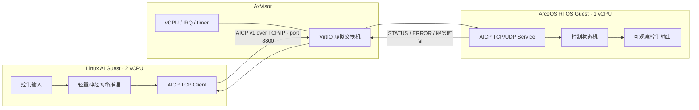

# AxVisor 多 Guest 智能控制演示平台：技术报告与复现手册

## 1. 目标与范围

本成果在 AxVisor/QEMU AArch64 平台实现三个相互关联、但可独立验证的能力：

1. AxVisor vCPU idle、定时器和唤醒路径的实时性改造与回归；
2. Linux/StarryOS 一侧与 RTOS 一侧可复用的 AICP/IP 通信协议；
3. Linux AI Guest 的轻量神经网络与 YOLOv8n ONNX Runtime CPU 推理、跨 Guest TCP/IP 控制下发、ArceOS/FreeRTOS 控制输出和状态回传。

当前实跑闭环包括 Linux（2 vCPU）与 ArceOS（1 vCPU）、Linux（2 vCPU）与 FreeRTOS（1 vCPU），以及 Linux–ArceOS 的 Rust YOLOv8n + ONNX Runtime CPU 三图控制闭环。StarryOS、RKNN、RT-Thread 与 Zephyr 保留对应实现和复现入口。

本成果对应上游总跟踪议题 [#2154](https://github.com/rcore-os/tgoskits/issues/2154)：第 5 节对应任务一，第 3 节对应任务二，第 4 节对应任务三。三项能力可分别回归，但比赛演示以第 4 节的网络控制闭环为主线。

## 2. 系统架构



默认双 Guest 拓扑使用 4 个 pCPU：pCPU0 处理 AxVisor 管理和设备工作；ArceOS vCPU0 绑定 pCPU1；Linux vCPU0、vCPU1 分别绑定连续的 pCPU2、pCPU3。连续绑定用于满足当前 GICR redistributor 资源范围约束。Linux/ArceOS 的 IPv4 地址分别为 `10.0.3.3/24` 与 `10.0.3.2/24`，通过 VirtIO 虚拟网卡和 AxVisor 虚拟交换机通信；控制数据不依赖共享内存、HyperCall、裸 MMIO 或 vsock。

## 3. AICP 协议

主闭环使用 **AICP v1 over TCP/IP，端口 8800**。帧中包含 `magic`、`version`、消息类型、头长、载荷长度、序号、时间戳、错误码和 CRC。应用消息包括 `HELLO`、`HEARTBEAT`、`CONTROL_SET`、`STATUS`、`ERROR`。

TCP 路径显式分帧、设置读写超时并支持断线重连。序列号和重放缓存是单个 accepted TCP 连接的会话状态；跨连接仅保留控制状态，因而重连客户端可从新的 HELLO/序列重新开始。服务端读取结构、长度和 CRC 完整的未知版本帧后返回 `ERROR_VERSION`，而不是仅关闭连接。

协议同时提供 UDP 数据报路径，用于可靠性对比：应用层 ACK/状态确认、超时重传、重复包重放、乱序拒绝，以及版本、长度、类型和 CRC 校验。UDP 不作为当前 QEMU 控制闭环的主数据通道。

## 4. AI 到 RTOS 控制闭环

Linux initramfs 客户端调用 `simple_nn` 与 `control_policy`，把输入映射为 `CONTROL_SET` 的控制目标。ArceOS 服务解析并校验载荷，更新控制状态机，打印 `CONTROL seq=...`，再返回含处理结果与时间信息的 `STATUS`。

轻量神经网络 smoke 使用 3 次 AI 模式事务，成功标记为：

```text
AICP_RTOS_READY
AICP_RTOS_NET_READY iface=eth0 ip=10.0.3.2/24
AICP Linux guest client starting
CONTROL seq=...
AICP_LINUX_DONE ok=3 failed=0
[ai-rtos] PASS: Linux-to-ArceOS AICP TCP/IP control loop completed
```

在容器内嵌套 QEMU 的验证环境中，集成 runner 将该场景的 TCP I/O 超时设为 15 秒，避免把宿主模拟负载下的调度延迟误判为协议断开；通用客户端默认超时仍为 3 秒。

Rust YOLOv8n 路径使用同一 Linux–ArceOS TCP/IP 拓扑。实际三图运行输出：

```text
AICP_YOLO_RUST_BEGIN model=/model/yolov8n.onnx images=3 ... backend=onnxruntime-cpu
AICP_YOLO_RUST_CONTROL image=/validation/tennis-ball-close.jpg ... rtt_ns=203928208
AICP_YOLO_RUST_CONTROL image=/validation/tennis-ball-black-box.jpg ... rtt_ns=351020592
AICP_YOLO_RUST_CONTROL image=/validation/tennis-ball-plant.jpg ... rtt_ns=698186992
AICP_YOLO_RUST_DONE ok=3 failed=0 avg_infer_ns=62841325066 avg_e2e_ns=64977108037
```

## 5. AxVisor 实时性改造

优化配置 `os/axvisor/configs/board/qemu-aarch64-rt.toml` 启用 `rt-poll-idle`。改造覆盖 AxVM vCPU runtime 等待/通知、AArch64 WFI/PSCI standby 处理、定时器 deadline 推进和设备 poll 触发路径：当 Guest 执行 WFI 或 PSCI standby 时，绑定的 vCPU 不进入共享等待队列，而是在专用 pCPU 上保持 polling；每次 VM exit 推进定时器和设备轮询，并保留协作式 yield，避免无限 polling 饿死设备或管理任务。

双 Guest 配置使用 4 个 pCPU，ArceOS vCPU 固定在 pCPU1，Linux 两个 vCPU 固定在 pCPU2/pCPU3，pCPU0 留给 AxVisor 管理和设备工作。该绑定把实时 Guest 的 idle/wake 处理与管理/网络设备处理分开；具体 Guest 内存、VirtIO 设备和中断路由均由 `os/axvisor/configs/board/qemu-aarch64-rt.toml` 及其关联 Guest 配置声明。

`qemu-aarch64-rt-shared-wait-control.toml` 是同拓扑、同设备映射下保留共享 wait queue/broadcast wake 的**对照配置**；它不是原生 RTOS 基线。原生 RTOS 周期基线必须单独采集并与虚拟化网络闭环数据分开解释。

实际 AArch64 QEMU 回归：

```sh
cargo xtask image pull qemu-aarch64 --extract-dir tmp/axbuild/images
cargo xtask axvisor test qemu --arch aarch64 --test-case rt-poll-idle-timer-wake
```

该用例验证 idle 后由定时器事件恢复执行，并匹配 `AXVISOR_RT_POLL_IDLE_TIMER_WAKE_PASSED`。

已完成的证据证明该 feature 可构建、FDT/运行时逻辑可通过 host 回归，并且 AArch64 QEMU 可完成一次 idle→timer wake→继续执行。它们不等价于周期抖动、调度延迟、中断响应延迟和长时间压力数据；这些指标仍需按 #2154 的固定平台/负载方案采集原始日志后报告，不能用 timer wake 成功代替。

## 6. 构建与复现

### 6.1 协议与服务主机回归

```sh
make -C apps/ai-rtos-demo clean test
cargo test --manifest-path components/aicp-protocol/Cargo.toml --all-features
cargo clippy --manifest-path components/aicp-protocol/Cargo.toml --all-features -- -D warnings
```

### 6.2 ArceOS standalone 服务

```sh
cargo xtask arceos qemu \
  --package arceos-aicp-server \
  --config apps/arceos/aicp-server/build-aarch64-unknown-none-softfloat.toml \
  --arch aarch64 \
  --qemu-config apps/arceos/aicp-server/qemu-aarch64.toml
```

成功标记为 `AICP_RTOS_READY`，启动日志会显示静态 `eth0=10.0.3.2/24`。

### 6.3 双 Guest 闭环

```sh
scripts/ai-rtos/aicp.sh doctor
scripts/ai-rtos/aicp.sh prepare
scripts/ai-rtos/aicp.sh smoke 3 ai 300
```

## 7. 可观测性与边界

运行日志默认写入 `tmp/ai-rtos/logs/`。协议和控制状态通过消息类型、序列号、`CONTROL`、`STATUS`、RTT 和服务时间观测；实时路径通过 timer wake 回归及周期任务统计观测。

本成果不以一次 QEMU 运行宣称长期最坏情况性能改善百分比，也不以当前轻量模型 smoke 替代 YOLOv8/RKNN 真实部署证明。完整压力矩阵、长稳运行和多 RTOS/多板卡对比应继续保留原始日志、硬件条件和样本数据后独立报告。
